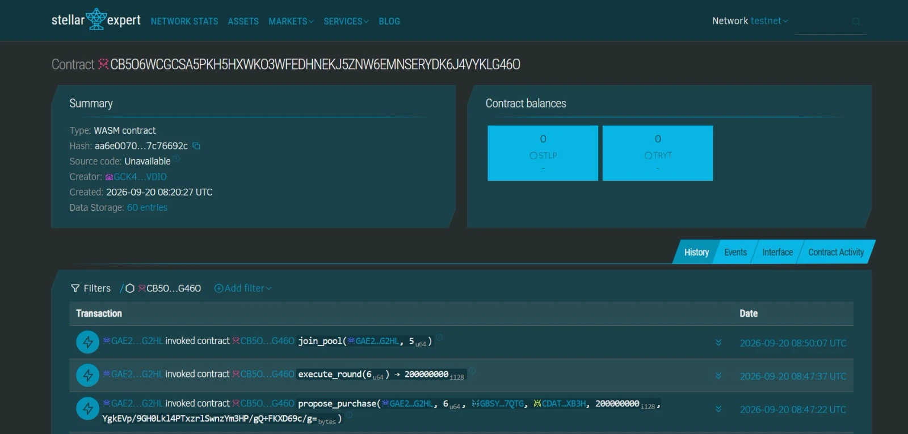
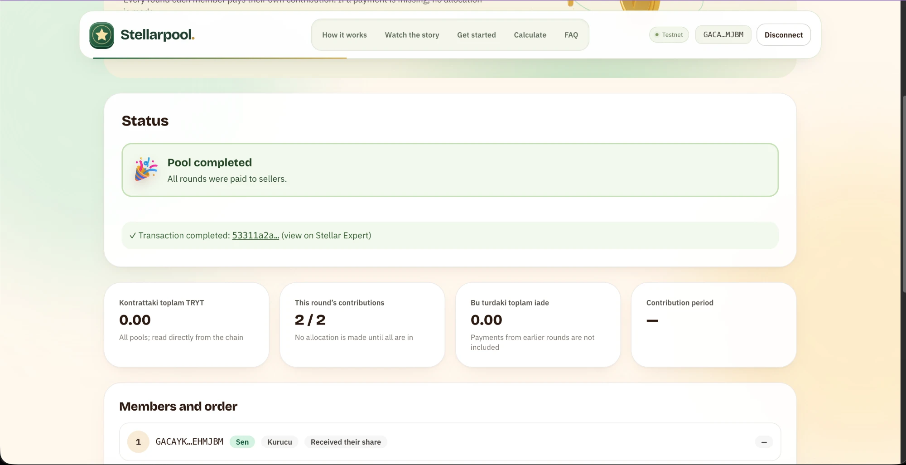
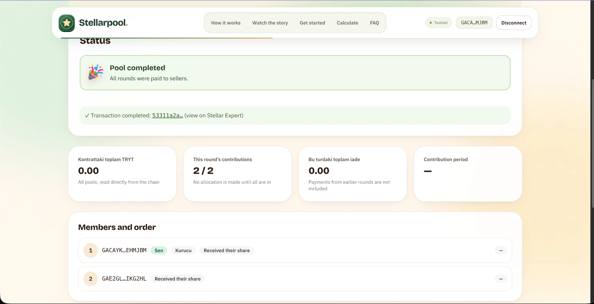

# Stellarpool

**Save together. Verify everything.**

A transparent group savings pool on Stellar, where the rules live in a Soroban smart contract instead of in someone's pocket.

[Live demo](https://stellerpool.arslanyusuf.com) · [Contract on Stellar Expert](https://stellar.expert/explorer/testnet/contract/CB5O6WCGCSA5PKH5HXWKO3WFEDHNEKJ5ZNW6EMNSERYDK6J4VYKLG46O) · [Architecture](docs/architecture/architecture.md) · [Plan](docs/plan.md)

Rise In x Stellar **Pro Hackathon 2026** · Track: **Genesis** · Network: **Stellar Testnet** (no real money)

---

## The idea in 30 seconds

Friends, families and colleagues in Turkey have long saved together for a home, a car or a shared goal: "gold days" circles, and the draw-based or ordered groups run by savings-finance companies such as Eminevim and Fuzul. The shared problem is **trust**. The money sits with one person or one institution, the rules are not visible to everyone, and nobody knows what happens when a member stops paying.

**Stellarpool moves that coordination into a Soroban smart contract.**

- **Nobody holds the pot.** Contributions are locked in the contract per round. The founder cannot withdraw the shared money, and neither can we: the contract has no admin, upgrade, pause or fee function.
- **Money goes to the seller, not to a person.** When it is a member's turn, the amount (the pool plus their own down payment) can only go to the registered seller, and only after every contribution of the round is in and the recipient has recorded the purchase.
- **Fair turns.** The recipient comes from a fixed order (the join order) or from an on-chain **draw** among members who have not received yet. Groups of 2–30 members are supported.
- **Failure is bounded and visible.** If someone stops paying, the round stops after a grace period and **only that round's contributions** (plus unspent down payments) are refunded to their owners. Anyone can trigger this; no administrator is needed.
- **Anyone can verify.** Every rule and every payment is on-chain. You do not have to trust us, you can check.

**Target user:** small groups of people who know each other and want to save toward a shared purchase, by rotation or by draw.

## How it works

1. **Join a pool.** Enter the total price, the down payment and the installment you can afford; the number of people and the term are worked out automatically, and you are routed to an open pool with the same plan (or a new one is opened).
2. **The group fills.** Members join with their wallets and deposit their down payments. When the group is full, the join order becomes the delivery order (or a draw picks the recipient each round).
3. **Rules lock in.** Everyone approves the same installment and schedule terms. Nobody, including the founder, can change them afterwards.
4. **Everyone pays.** Every round each member deposits their own contribution into the contract. A member who is short of balance can load the pool asset through our SEP-1/10/24 anchor inside the same step.
5. **The seller is paid.** The recipient records the seller and the purchase-document digest; anyone can then trigger the payment, and the amount goes straight to the seller.

## Proof on-chain

Everything below can be checked on Stellar Expert. This is the live v12 contract: a member joining a pool (`join_pool`), a purchase being recorded (`propose_purchase`) and the round being paid to the registered seller (`execute_round`). After the payout the contract's own balances are back to **0** for both assets, because the money went to the seller and none was kept.

*The v12 contract on Stellar Expert (Testnet): WASM hash `aa6e0070…7c76692c` (the same hash listed under [Contract and deployment proof](#contract-and-deployment-proof-testnet)), the `join_pool`, `propose_purchase` and `execute_round` calls, and the contract's STLP and TRYT balances at 0.*

### The app after a completed pool

The same flow seen from the interface: a two-member pool on Testnet after both rounds were paid. The status card reads "Pool completed", all contributions of the round are in (2 / 2), the contract holds **0** of the pool asset (`TRYT`), and both members are marked as having received their share. The transaction link opens the last payment on Stellar Expert.

*Screenshots of the Testnet demo (no real money). Some labels in these captures were taken before the interface was fully translated to English; the live site now uses English throughout.*

More proofs (cancel + refund, draw with a down payment, a pool that could not be set up, and the older v10/v11 contracts) are listed in [Contract and deployment proof](#contract-and-deployment-proof-testnet) below.

## Status

**API v12** was developed in this repository, deployed to Testnet, and passes 33 contract tests. The verifier role and purchase approval were removed. In fixed order, the delivery order is created automatically from the join order once the pool is full; members still approve the starting terms. The entry point offers only Home, Car and Other: the term and the number of people are computed from the price, down payment and monthly installment. The quick demo keeps its own minute-scale schedule. The monthly schedule is set automatically, but every payment still needs the member's wallet signature.

**The current Testnet contract is API v12:** [`CB5O6WCGCSA5PKH5HXWKO3WFEDHNEKJ5ZNW6EMNSERYDK6J4VYKLG46O`](https://stellar.expert/explorer/testnet/contract/CB5O6WCGCSA5PKH5HXWKO3WFEDHNEKJ5ZNW6EMNSERYDK6J4VYKLG46O). Old v11 pools stay in their own immutable contract; the same pool number in v12 can refer to a different pool. The v11/v10 proofs below belong to earlier contracts.

## What works today, and what does not

| Area | Status |
|---|---|
| Soroban contract (sponsor-free, **API v12**: purchase without verifiers, automatic order, draw, 30 members, down payment) | ✅ Live on Testnet; 33 unit tests and v12 live scenarios. Earlier v11/v10 proofs are below |
| Interface ↔ contract | ✅ The v12 interface was built against the new contract and checked with real Testnet reads. ⚠️ The wallet-signed write flow has not yet been tried end-to-end with a real Freighter |
| Anchor | ✅ **Our own SEP-1 / SEP-10 / SEP-24 anchor** (`https://anchor-stellerpool.arslanyusuf.com`, Testnet, Node.js/TypeScript, source: [`backend/`](backend/)). It mints the `TRYT` test asset (issuer `GBM3V2AHDEF3APOIKRCXCKVNW3UA2VWMSLTGELWRLBLIFSV7OVME6HOC`, SAC `CDATFFDUVSMP2OC6JKIRWJDUHFTNMWJ2ZXLUCDUTRD7FYXANOV7RXB3H`). It sits **inside the contribution step** on the pool page: a member with insufficient balance loads the pool's own asset through the anchor. Verified end-to-end (SEP-10 login, SEP-24 deposit, a real on-chain TRYT transfer). ❌ **Not Turkish lira**: `TRYT` is only a test asset that represents TRY; there is no real banking rail. Wallet-signed deposit was not tried with a real wallet |
| Draw mode and 30 members | ✅ Live in the contract ([task list](docs/CONTRACT_HANDOFF.md)); "Draw" can be selected in the interface. Randomness is hackathon-grade |
| Down payment | ✅ In the contract: per member, paid on joining, added to your purchase and sent to the seller when your turn comes, refunded if unspent on cancellation. Unlike at companies it does not count toward savings and is not collateral |
| Mainnet | Read-only showcase build; no wallet signing and no funds actions |

## Contract and deployment proof (Testnet)

### Current contract: API v12 (purchase without verifiers + automatic order)

- **Contract ID:** [`CB5O6WCGCSA5PKH5HXWKO3WFEDHNEKJ5ZNW6EMNSERYDK6J4VYKLG46O`](https://stellar.expert/explorer/testnet/contract/CB5O6WCGCSA5PKH5HXWKO3WFEDHNEKJ5ZNW6EMNSERYDK6J4VYKLG46O) · API version 12 · WASM SHA-256 `aa6e0070f62199a7cbd2bd8ccc3ae7dfda3e5295924ba015a550f63a7c76692c` · 30,996 bytes · [WASM upload](https://stellar.expert/explorer/testnet/tx/39f74452ca7dd4d1bf97a661c91693fb1863417beae71ee55c3a0256e07e5e09) · [contract deployment](https://stellar.expert/explorer/testnet/tx/49c2a63e2b7ba13bf8904fc6b3cb93de847dc7d0b82fa1dcfd530b8ac47cd731).
- **Flow:** In fixed order the order is written when the last member joins; members approve the terms. Everyone deposits their contribution, the recipient records the purchase, and within the deadline `execute_round` pays the demo seller. `propose_terms` and `approve_purchase` no longer exist. The normal schedule consists of 30-day rounds; every monthly contribution needs its own wallet signature. The quick demo uses 3-minute rounds.
- **Testnet proof:** [Pool #2](https://stellar.expert/explorer/testnet/tx/6d8ccd206eb0222f88bb0b1113fe73e36c009a7c5bed538b28c464ae7a2d5acd) paid and completed both rounds in fixed order with no additional verifier (STLP test asset, no real delivery). `scripts/demo_testnet.sh` is used for the cancel/refund and draw scenarios.

### Previous contract: API v11 (draw + 30 members + down payment)

- **Contract ID:** [`CD23I5ZNVHOUBJOHODHHEW6NH7NB3FDBQ2DE2C2TST5BZM4KTJLBPK33`](https://stellar.expert/explorer/testnet/contract/CD23I5ZNVHOUBJOHODHHEW6NH7NB3FDBQ2DE2C2TST5BZM4KTJLBPK33) · API version 11 · WASM SHA-256 `0f7ae90a…3b14` · 34,982 bytes · [deployment transaction `7cc3648b…4dec`](https://stellar.expert/explorer/testnet/tx/7cc3648b7c6a6c163911a03eaa9406ecd075f8e9dcb9e4a63ac3af2417154dec)
- **Change (v10 → v11):** `create_pool` gained `down_payment` (per member, 0 = off). `join_pool` pulls the down payment into the contract; `propose_purchase` / `execute_round` require the purchase amount to be *pool + the recipient's own down payment* and pay that to the seller; `claim_refund` / `get_member_status` add the not-yet-spent down payment to the refund entitlement; in a pool that could not be set up (`cancel_unstarted_pool`), those who joined get their down payments back. New error `InvalidDownPayment`. With a down payment of 0, behavior is identical to v10.
- **Unit tests:** 33 (27 existing + 6 new): the down payment being pulled on join and added to the purchase, no dust in draw mode, refund of "current-round contribution + unspent down payment" on cancellation, refund for a pool that could not be set up, being unable to join with too little balance, rejection of a negative down payment.
- **Live verification (20 September 2026, `TRYT` asset, the interface's service layer and creation form, signed with single-use test keys; not tried with a real Freighter):**
  - Pool #1 (v11): a 3-member **draw + 6 TRYT down payment**, created from the creation form and completed. On joining, 3 × 6 TRYT were pulled into the contract; each round a purchase proposal made with the pool amount alone (30) was **rejected**, and the amount including the winner's down payment (36) was accepted; the seller received 36 per round, 108 in total; winners were M2 → M3 → M1 (no repeats); the contract balance ended at **0**.
  - Pool #3 (v11): **cancellation + refund**. 3 members, down payment 5, contribution 10. In round 1 M1 received; in round 2 M3 did not pay → grace period → cancellation. Refund entitlements were M1 = 10 (received, this round only), M2 = 15 (contribution + down payment), M3 = 5 (down payment only); all three were paid in full and a second refund was rejected.
  - Pool #4 (v11): **a pool that could not be set up**. The setup period ended, it was cancelled, and the two members who had joined got their 4 TRYT down payments back in full. The on-chain records of older pools stay in the [v11 contract](https://stellar.expert/explorer/testnet/contract/CD23I5ZNVHOUBJOHODHHEW6NH7NB3FDBQ2DE2C2TST5BZM4KTJLBPK33).
  - Pool #2 is an unfinished attempt caused by too-short test durations (it was cancelled and refunded); it does not count as proof.

### Previous version: API v10 (kept on-chain as proof)

- **Contract ID:** [`CC7W3SKQHBLZ2JPTGSK42H6IAJQ22A4PUK6CSN2T4PUJRY4LQ445GYMB`](https://stellar.expert/explorer/testnet/contract/CC7W3SKQHBLZ2JPTGSK42H6IAJQ22A4PUK6CSN2T4PUJRY4LQ445GYMB) · API version 10 · WASM SHA-256 `6cc5e1a0…12b4` · 34,070 bytes
- **Upload:** [`d0f9e5cb…7867`](https://stellar.expert/explorer/testnet/tx/d0f9e5cbbf023a9dde46ab2017b362f9ea8dc6a5ac643b109cabd304ba647867) · **Sample creation:** [`5c7ae114…91a1`](https://stellar.expert/explorer/testnet/tx/5c7ae11430ec06055f612027ab046888f88ddcd83d3addd6c6328bd92d7a91a1)
- **Pool #1 (ordered, happy path):** [`create_pool`](https://stellar.expert/explorer/testnet/tx/7f14ac89fcc63b43396c92a1770258fd9b4e9e1a6db5499c26e4c0d1fb3ee94e) → round 1 [`RoundPaid`](https://stellar.expert/explorer/testnet/tx/78bc813cae56605d08dedf5cf303e158f5a0731517663e1ac2177ae2ef177d2b) → round 2 [`RoundPaid + PoolCompleted`](https://stellar.expert/explorer/testnet/tx/ad5a8e6e9a379816c18fb23f84d6a49f497b42a54987f2c861c9968bb3993a01)
- **Pool #2 (canonical risk scenario):** [`create_pool`](https://stellar.expert/explorer/testnet/tx/5c20843227aea3656ca45c6a1644b6bf95df1fec033e3e4d67514d13e23755cd) → round 1 paid [`RoundPaid`](https://stellar.expert/explorer/testnet/tx/a00b3cf770d21634f64bebbbf75b46a897840061c20d6a2d3be33db06eb70ad6) → in round 2 only one member deposited [`deposit`](https://stellar.expert/explorer/testnet/tx/f513244596c4ba07d929fa8820d9aa92e1965b2ae5efdfe589b985528fa048fc) → deadline missed, `mark_overdue`, `abort_pool` → only that member claimed their refund [`claim_refund`](https://stellar.expert/explorer/testnet/tx/d4171a4866f9e7fa15db371c00c26737ed132c33baba0b3363f482bcf4d60fd1); the share of the member who received in round 1 could not be recovered
- **Pool #3 (draw):** [`create_pool`](https://stellar.expert/explorer/testnet/tx/38dec31c1c9cfc2388ce1f6adda32ad7d97c1ecd77e245b9f6226a52d195e554) (`order_mode: Draw`) → two members deposited, the round is waiting for the draw [`RoundAwaitingDraw`](https://stellar.expert/explorer/testnet/tx/b1b05c4dfc1c3d40eb5b12572b41fa640c1385e491b592a774a872798756f4d4) → **an account that is not a pool member** held the draw [`draw_recipient`](https://stellar.expert/explorer/testnet/tx/11845a01bbfe010755af7e74588b408b469066ee8f9247dd668d12fdd0ea2822) → [`execute_round`](https://stellar.expert/explorer/testnet/tx/a253b14aee6bbd21329eb085ac7532fb984cabe3a92ee44f0bda698961e82609) → in round 2 the only remaining candidate was chosen deterministically [`draw_recipient`](https://stellar.expert/explorer/testnet/tx/a9266d236b33ab5b262942e5c9734f81e6dbcb641eb040d199866f7193ed74f9) → [`execute_round`](https://stellar.expert/explorer/testnet/tx/22b4c62efd755a75ca4c4d1f8a467c9a02f48890c49dba1f3796b50054bb72fa)
- **30-member resource measurement** (local test, a lower bound for a real Wasm host): `deposit` ≈ 1.1 M, `draw_recipient` ≈ 1.6 M, `execute_round` ≈ 1.4 M instructions (Mainnet limit 400 M); read/write entries are single-digit. No real 30-person Testnet run was made.
- Live pools #1–#3 were created with the `STLP` demo asset minted by the contract team (SAC `CAOV35NPIJXHWA7QPXXERRJQ4ZTDUGAEHA7FKB6QIOTIOTI62B35ZNWI`). On the live site, new pools are created with the anchor's `TRYT` asset; the interface reads each pool's own token and shows labels and balances accordingly.
- Earlier contract instances stay on-chain; **the current contract is the v12 above; v11 and v10 remain as proof.**
- **Demo URL:** https://stellerpool.arslanyusuf.com (Testnet; new pools are on the v12 contract). Testnet only, no real money.
- **End-to-end interface verification (v10 contract, 20 September 2026, with `TRYT`; these pools are on the v10 instance, and the live site now points to a newer contract):** The interface's own buttons and service layer were run, signed with **single-use test keys instead of a wallet extension** (not yet tried with a real Freighter):
  - Pool #5 (v10): a 3-member **draw** pool, created from the creation form. Join → terms → approval → start → contribution → **draw** → purchase proposal → 2 verifier approvals → amount to the seller. Winners were M1, M3, M2 in turn: every round came only from those who had not yet received, with no repeats. Member M3's balance was loaded from 0 to 40 TRYT through the interface's anchor flow (SEP-10 login + SEP-24 deposit). At the end the seller received 90 TRYT and the contract balance was 0.
  - Pool #6 (v10): a 2-member **fixed-order** pool; the approved order was applied exactly and two rounds were paid.
  - Pool #7 (v10): **cancellation + refund**. The contribution deadline passed because a member did not pay → grace period → cancellation; only the paying member reclaimed their contribution, the non-paying member's claim and a second refund attempt were rejected, and the contract balance was 0.

## Pool rules

- In an invite-only, fixed-membership group, the contribution, schedule and order are locked once the members approve the same version. The founder cannot change them alone and cannot withdraw funds.
- In each round the round's allocation is not opened until everyone has deposited **their own** contribution. If a payment is late, a grace period is given; if it is not met, the round is stopped.
- If the round has not yet been paid out to the seller, only **the contributions paid in that round** are refunded. Contributions that already went to a seller cannot be recovered from the contract.
- In API v12 the demo allocation goes only to the allowed test seller, after the recipient's purchase record and after all contributions are complete. There is no extra verifier approval; there is a separate deadline for the purchase.
- There is no separate sponsor, advance or platform guarantee.
- **The recipient is determined in two ways:** a fixed order approved by the members, or a **draw** (each round, among members who have not yet received, once all contributions are complete; anyone can hold it, and the winner has already paid their share). The group is **2–30 members**. Draw randomness is hackathon-grade (`env.prng()`).

**Open economic risk:** If four members deposit 10 units each and 40 units are paid to A's seller in round one, no round-one money is left in the pool. If A does not pay in the next round, the new round stops; B, C and D's round-one contributions cannot be recovered from the contract. Growing the number of members does not solve this. The risk is kept visible in the interface and in the story section. [Details](docs/plan.md).

## Comparison with Fuzul Ev / Oto and Eminevim

Savings-finance companies work without interest: the customer pays installments by dividing the contract amount over the term, the delivery order is determined by draw or by payment ratio, and the company pays the allocation to the seller. The cost is not interest but a one-time **organization fee**. The company column below shows **typical** values summarized from public pages ([Fuzul Ev FAQ](https://www.fuzulev.com.tr/merak-edilenler), [home financing](https://www.fuzulev.com.tr/ev-finansmani), [calculation guide](https://www.tasarruffinansmani.com/blog/fuzulev-hesaplama-rehberi)); rates vary by source and contract, and this is not advice.

| | Savings-finance companies (typical) | Stellarpool (Testnet prototype) |
|---|---|---|
| Funds | The company's segregated fund pool | Locked in the Soroban contract per round, the founder cannot withdraw |
| Installment | (Contract amount + organization fee) ÷ term | Target amount ÷ number of people, no extra fee |
| **Down payment** | Optional; paid to the company, it brings delivery forward or shortens the term | **In the contract, per member.** Paid on joining, added to your purchase and sent to the seller when your turn comes, refunded if unspent on cancellation. The higher it is, the smaller the pool target and the fewer the terms and people. Unlike at companies it does not count toward savings and is not collateral |
| **Fee** | One-time organization fee (about 7–14%), not refunded on withdrawal | **None**, no share is set aside for anyone |
| Term and group size | Usually 40–240 months; the company decides the group | As many monthly rounds as people (2–30). **Automatic:** pool target ÷ the installment you can pay |
| **Draw timing** | In the draw model, every month under notary supervision from the first month; in the non-draw model, the delivery date is fixed in the contract | Every round, once everyone has paid their installment, by an on-chain transaction anyone can call; the date is not fixed and there is no notary |
| Recipient | Order or draw | The approved fixed order, or a draw (hackathon-grade randomness) |
| Rules | A contract, tied to the company | Visible to everyone, verifiable on-chain |
| Delivery | The company pays the allocation to the entitled member | Only to the allowed demo seller, after the purchase record |
| If payment stalls | Installment freeze up to 6 months, delivery postponed | Grace period → the round stops → refund of the current round |
| Post-delivery security | Mortgage/pledge, company commitment | **None** (an open risk) |
| License | BDDK-licensed (Law No. 6361) | **None**, Testnet, no real money |

In the interface, the user enters the total price, the down payment and the installment they can afford; the number of people and the term come out automatically, and the user is routed to an open pool with the same plan (if there is no suitable pool, a pool is opened first and then joined). **There is no organization fee. In the v12 contract the down payment goes only to the member's own purchase;** it does not close the risk of someone who received early stopping later installments (it is not collateral). When a new contract is published, old instances stay in the old contract, so the interface reads the contract's real capabilities (the `create_pool` inputs) from the chain.

This does not replace a licensed financing product. Details and legal limits: [altin-gunu-legal-boundary.md](docs/altin-gunu-legal-boundary.md), [legal-ai-path.md](docs/legal-ai-path.md).

## Flow and architecture

Architecture diagram, components and state machine: [docs/architecture/architecture.md](docs/architecture/architecture.md).

~~~mermaid
flowchart TD
  A[Pool is created] --> B[Members approve the terms]
  B --> C[Each member deposits this round's contribution]
  C --> D{Are all contributions in?}
  D -->|No, grace period ended| E[This round's contributions are refunded]
  D -->|Yes| F[Seller and document are proposed]
  F --> G{Is the purchase record valid and in time?}
  G -->|No| E
  G -->|Yes| H[This round's amount is paid to the demo seller]
  H --> C
~~~

## Technology and running

| Folder | Purpose |
|---|---|
| `contracts/` | The Rust/Soroban `rotating_pool` contract and its tests |
| `frontend/` | Vue 3, TypeScript, Vite, Tailwind, Stellar Wallets Kit, three.js |
| `backend/` | The SEP-1/10/24 anchor service (Node.js/TypeScript) |
| `scripts/` | Testnet deployment and demo scripts |
| `docs/` | Product, legal, architecture and handoff documents |

**Interface:** `cd frontend && npm ci`, write `VITE_ROTATING_POOL_CONTRACT_ID=<the ID above>` into `.env`, then `npm run dev`. For the transaction-free showcase build that connects to Mainnet, use `VITE_STELLAR_NETWORK=mainnet npm run build`. Optional: `VITE_ANCHOR_HOME_DOMAIN` (default: the SDF test anchor), `VITE_MAX_MEMBERS` (default 30; use 12 if you connect to the old v9 contract).
**Contract:** `cargo test --workspace`; for Testnet deployment see [scripts/README.md](scripts/README.md).

## Stellar integrations

- **Soroban smart contract** (Rust): pool, round and refund accounting, payment to the registered seller.
- **Stellar Wallets Kit**: wallet connection and signing.
- **Anchor (SEP-1/10/24)**: our own service (`backend/`, `anchor-stellerpool.arslanyusuf.com`). stellar.toml discovery, wallet-signed SEP-10 login, SEP-24 interactive deposit; fully explained on the home page and, on the pool page, built into the flow as a "load balance" step before contributing. The pool asset is suggested only if the anchor offers the same code and issuer. The interface does not present `TRYT` as real TRY ("test asset representing TRY · not real TRY"). This is a demo anchor: the "I deposited TRY" confirmation triggers the server itself, not a bank; when a real licensed TRY anchor is connected, only `VITE_ANCHOR_HOME_DOMAIN` changes.
- **Stellar Asset Contract (SAC)**: the pool asset (`TRYT` on the live site; `STLP` in old live pools; Testnet USDC by configuration).
- **Stellar SDK 17 / Soroban RPC / Horizon**: contract client and account reads.

## Design decisions and problems solved

- **Sponsor removed:** The first design included a sponsor guarantee; it was removed because it contradicted the "the money is already locked" intuition and hid the real risk. It was replaced by a sponsor-free model that shows the risk openly.
- **Only the current round is refunded:** The money of a round already paid to the seller is not in the contract. Instead of hiding this constraint, the interface explains it with a story that plays by itself ("This is how a round works").
- **Interface ↔ contract compatibility:** The contract and the interface were developed in parallel. The interface reads the contract's real capabilities from the chain and refuses to send transactions on an incompatible version (sponsored, without draw). In testing against the live contract, two things the stub did not show were found and fixed: the SDK's `Result` wrapper (`Ok { value }`) and the contract's `get_member_status.refundable` value also being filled in the last round of a completed pool (because the money went to the seller, the interface shows it as zero; `claim_refund` works only on a cancelled pool).
- **Trade-off:** The contract cannot be upgraded (a new ID is needed); a timeout does not start a transaction by itself, and anyone calls the relevant function.

## Submission status

- [x] Sponsor-free contract (API v12: draw + 30 members + down payment + purchase without verifiers), 33 unit tests, live on Testnet with live scenarios run
- [x] Contract ID and deployment proof (above)
- [x] Interface connected to the contract: reads are live, `create_pool` was simulated, draw can be selected in the interface
- [x] A real SEP-1/10/24 anchor client (with the test anchor) and our own anchor service
- [x] A transaction-free showcase build for Mainnet that reads live network info
- [x] Architecture diagram and technical documents
- [ ] End-to-end trial of the wallet-signed write flow (create/pay/approve/draw)
- [x] Public demo URL (https://stellerpool.arslanyusuf.com)
- [ ] **Real TRY anchor in/out and usable balance** (a hackathon core requirement, not met)
- [x] Draw mode and 30 members ([task list](docs/CONTRACT_HANDOFF.md) implemented)
- [ ] Presentation (official Stellar template)
- [ ] A reasoned report for the AI reviewer and a human decision

## Roadmap (after the hackathon)

1. Verifiable draw randomness via commit-reveal or an external source; a real 30-person load test.
2. Real TRY in/out with a verified TRY anchor; the withdrawal (Stellar → TRY) flow.
3. Passkey / smart-wallet sign-in for users with no crypto background.
4. An AI-assisted report on document and terms inconsistencies (without any funds authority).
5. A licensed partnership and legal framework for a real product (BDDK/SPK/TCMB assessment).

This document is a product/technical description; it is not legal advice or a guarantee of real money.
