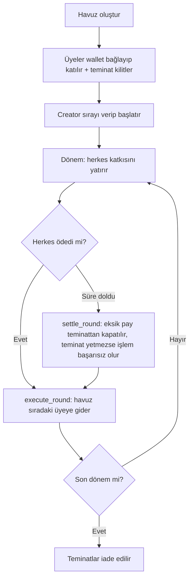

# Stellerpool — EvAraç Tasarruf Havuzu

> Birlikte biriktir. Her şeyi doğrula. — *Save together. Verify everything.*

Stellar / Soroban tabanlı, şeffaf ortak tasarruf havuzu. Ev, araç veya başka büyük hedefler için birlikte düzenli birikim yapılan gruplarda para bir şirketin hesabında değil, **Soroban akıllı kontratında** durur. Kurallar kodda yazılıdır, kimse araya giremez.

Rise In x Stellar **Pro Hackathon 2026** (19–20 Eylül, İstanbul) için geliştiriliyor. Track: Genesis.

## Durum
Proje planlama aşamasında. Kontrat, arayüz ve anchor entegrasyonu henüz yazılmadı. Bu README ilerledikçe güncellenecek.

## Problem
Türkiye'de yaygın olan katılım / birikim gruplarında para merkezi bir organizatörün hesabında toplanır. Üye şu sorularla karşı karşıyadır: Param nerede? Sıram değiştirilebilir mi? Diğer üyeler ödedi mi? Biri parayı alıp ödemeyi bırakırsa ne olacak?

## Çözüm
- Fonlar kontratta tutulur, yönetici para çekemez, kontrat upgrade edilemez.
- Sıra havuz başladıktan sonra değiştirilemez.
- Herkes ödediğinde havuzun tamamı otomatik olarak sıradaki üyeye gider.
- Katılırken kilitlenen **teminat**, ödemeyi aksatan üyenin eksik payını kapatır (bir katkı kadar).
- Kim ne zaman ödedi, zincirde herkese açık.
- Kullanıcı TL ile öder, anchor TL'yi Stellar asset'ine çevirir, kontrat kuralları uygular.

Ürün kredi veya finansman sağlamaz, para garantisi vermez. Bir birikim grubu altyapısıdır.

## Nasıl çalışır

## Teknoloji
- **Kontrat:** Rust + Soroban SDK, Stellar Testnet
- **Frontend:** Vue 3 + TypeScript, Stellar Wallets Kit
- **Fiat giriş/çıkış:** Stellar anchor (SEP) üzerinden TL
- **Araçlar:** Stellar CLI, Stellar SDK, Stellar RPC, Stellar.Expert

## Klasör yapısı
| Klasör | Amaç |
|--------|------|
| `contracts/` | Soroban akıllı kontratları |
| `frontend/` | Web arayüzü |
| `backend/` | Anchor entegrasyonu için gerekirse ince proxy |
| `scripts/` | Deploy ve testnet yardımcı scriptleri |
| `docs/` | Plan ve mimari dokümanlar ([plan](docs/plan.md)) |

## Bilinen sınırlar
- Teminat bir katkı kadardır. MVP her üye için en fazla bir kaçırılmış katkıyı emer; sonraki default'lar havuzu bloke edebilir. Tam temerrüt koruması yoktur.
- Sıra sabittir, kura yoktur.
- Non-custodial olan havuz mantığıdır; stablecoin ihraççısı ve anchor merkezi taraflardır.
- Testnet MVP'dir. Gerçek parayla kullanmadan önce hukuki danışmanlık gerekir.

## Yol haritası
Sıraya göre artan teminat → itibar skoru → temerrüt rezervi → sigorta → doğrulanabilir rastgele kura → diğer ülkelerin yerel para birimi anchor'ları. Sonraki adım: SCF / InstaAwards başvurusu.

## Contract ID'ler ve demo
Deploy sonrası buraya eklenecek.

## Teslim durumu
- [ ] Kontratlar Testnet'te, contract ID'ler dokümante
- [ ] Frontend URL'i ve herkese açık demo
- [ ] Anchor üzerinden TL giriş veya çıkışı
- [ ] Kurulum, test ve değerlendirme talimatları
- [ ] Sunum (resmi Stellar Pro Hackathon şablonu)
