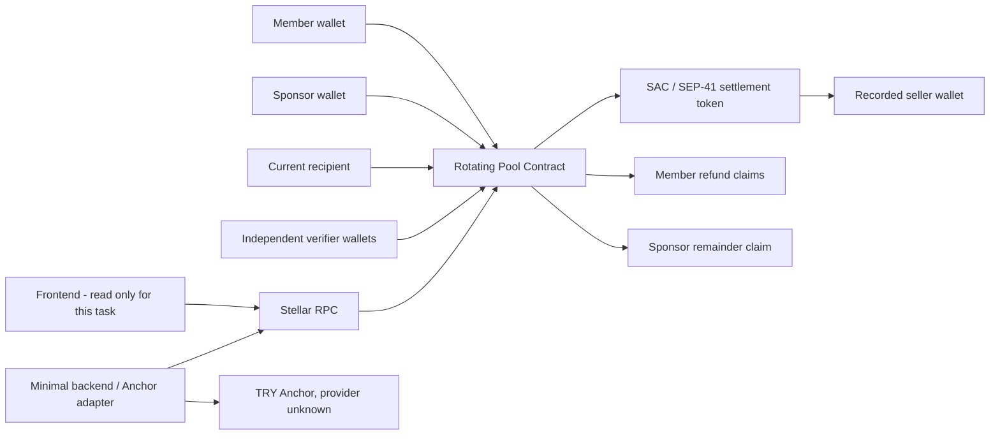

# Stellerpool Backend & Soroban Implementation Plan

Source of truth: `docs/plan.md`. This implementation plan translates that product and economic model into phased contract/backend work. When older repository notes conflict with `docs/plan.md`, this plan follows `docs/plan.md`.

Current status: Phase 7 is complete and awaiting review. Deadline enforcement, deterministic Grace, member cure, exact sponsor top-up, safe Active recovery, Paused transition, permissionless abort, delivered/not-delivered member refund claims, and order-independent sponsor remainder claim are implemented. No frontend file is in scope.

## 1. Current Repository State

Implemented:

- Protocol 28 Rust workspace with `soroban-sdk 28.0.0`.
- `rotating_pool` multi-pool contract crate.
- Typed pool/member/round models, storage keys, errors, and events.
- Persistent storage TTL helpers.
- Read API, unit-test scaffold, SDK test snapshots, and canonical WASM build.
- Immutable-on-start verifier policy, purchase proposal, and approval quorum flow.
- Solvency-checked seller payout, liability reclassification, round advancement, and pool completion.
- Overdue, Grace, member cure, separate sponsor top-up, and Paused recovery lifecycle.
- Permissionless abort from Paused, delivered/not-delivered member refund claims, and order-independent sponsor remainder claim.

Not implemented yet:

- Deployment scripts, Testnet evidence, backend, and Anchor adapter.

Frontend remains read-only and must not be modified by this workstream.

## 2. Requirements Extracted From Documentation

The controlling requirements from `docs/plan.md` are:

- MVP is a fixed-order savings pool with one contribution per member per round and one allocation per member.
- Members do not lock entry collateral. The earlier one-contribution member-collateral model is removed.
- A separate sponsor funds the pool guarantee.
- Minimum initial guarantee is `floor(member_count^2 / 4) * contribution_amount`.
- Sponsor guarantee and member contributions are accounted separately.
- Creator configures the pool but cannot withdraw pool funds, reorder an active pool, replace a seller unilaterally, or approve a purchase alone.
- Lifecycle is `Filling -> Active`, with `Grace` and `Paused` for overdue/recovery handling, then `Completed` or `Aborted`.
- All members, fixed recipient order, and minimum sponsor guarantee must exist before start.
- A round contribution can be collected once per member.
- Missing contributions do not silently reduce another member's allocation or refund rights.
- A member may cure an overdue contribution. The sponsor may separately top up a round shortfall without erasing the member's off-chain debt.
- The round allocation goes to a recorded seller, not to the recipient member.
- Seller address and purchase-document digest are proposed by the current recipient.
- Designated independent verifiers approve a purchase; creator approval alone is insufficient.
- `execute_round` is permissionless only when the round pot is complete, purchase approval exists, and post-payment refund solvency remains intact.
- If safe continuation is unavailable after the configured grace period, anyone may trigger abort.
- On abort, members who have not received an allocation reclaim all completed contributions. Members who already received an allocation reclaim only contributions made into an unfinished round.
- Sponsor receives only the guarantee remainder left after all member refund liabilities are covered.
- Every balance and claim is scoped by `pool_id`; pools never cross-subsidize one another.
- Contract amounts are integer token base units. TRY and fiat conversion remain in the Anchor layer.
- No yield, lending, staking, liquidity-pool strategy, unilateral upgrade, or admin escape hatch is part of the MVP.
- Testnet/demo claims must clearly distinguish simulated purchase verification from real property or vehicle delivery.

## 3. Architecture

Contract:

- Owns authoritative pool configuration, sponsor guarantee, membership, order, rounds, contributions, purchases, approvals, liabilities, claims, and lifecycle.
- Transfers only the pool's configured token.
- Pays only the approved seller for the current round.

Backend:

- Discovers and orchestrates Anchor flows.
- May cache RPC/Anchor status and provide diagnostics.
- Never decides financial state, approvals, payout amount, refund entitlement, or pool solvency.

Off-chain verifier/legal layer:

- Validates seller identity, documents, property/vehicle records, and legal security.
- Produces approvals for test data in the hackathon prototype.
- Does not make a Testnet demonstration equivalent to legal title transfer.

## 4. On-chain vs Off-chain Responsibilities

ON-CHAIN:

- Pool creation and immutable active configuration.
- Sponsor identity, required guarantee, funded guarantee, and sponsor top-ups.
- Membership and fixed recipient order.
- Round deadlines, grace deadlines, and lifecycle transitions.
- Per-member per-round contribution records.
- Per-pool assigned balance and refund-liability accounting.
- Purchase proposal, seller address, document digest, verifier approvals, and quorum.
- Exact seller payout and post-payment solvency check.
- Abort, member refund claims, and sponsor remainder claim.
- Typed events and claim replay protection.

OFF-CHAIN:

- Anchor SEP-1/10/24/6/12/38 orchestration as supported by a real provider.
- KYC/AML, TRY payment rails, issuer risk, and exchange-rate disclosure.
- Seller, invoice/contract, title/deed/registration, mortgage/lien, and legal collection verification.
- Notifications, restructuring negotiation, and off-chain debt collection.
- Monitoring, indexing, metadata, and demo evidence.

The backend is never the financial source of truth.

## 5. Storage Design

Instance storage:

- `NextPoolId -> u64`

Persistent storage, always scoped by `pool_id`:

- `Pool(pool_id) -> Pool`
- `PoolMembers(pool_id) -> Vec<Address>` with a validated hard cap.
- `Member(pool_id, member) -> MemberState`
- `RecipientOrder(pool_id) -> Vec<Address>`
- `VerifierPolicy(pool_id) -> VerifierPolicy`
- `Round(pool_id, round) -> RoundState`
- `Deposit(pool_id, round, member) -> bool`
- `RoundPot(pool_id, round) -> i128`
- `MemberContributionTotal(pool_id, member) -> i128`
- `PoolAssignedBalance(pool_id) -> i128`
- `GuaranteeBalance(pool_id) -> i128`
- `RoundTopUp(pool_id, round) -> i128`
- `Purchase(pool_id, round) -> PurchaseState`
- `VerifierApproval(pool_id, round, verifier) -> bool`
- `RefundLiability(pool_id, member) -> i128`
- `TotalRefundLiability(pool_id) -> i128`
- `RefundClaimed(pool_id, member) -> bool`
- `SponsorRemainderClaimed(pool_id) -> bool`

No member-collateral key is used. Existing Phase 1 collateral placeholders are removed in Phase 2 before deployment.

Every successful deposit initially increases both the member refund liability and the pool total refund liability. Later seller-payout logic may reduce or reclassify those preliminary liabilities only under the delivered/not-delivered and post-payment solvency rules.

TTL policy:

- Extend instance TTL on global reads/writes.
- Extend persistent TTL for every touched financial record.
- Ensure TTL horizons cover the full pool, grace, abort, and claim periods.
- Add explicit TTL tests before Testnet deployment.

## 6. Contract API

Target P0 API, refined during implementation without weakening the documented economics:

- `create_pool(creator, sponsor, token, contribution_amount, member_limit, round_duration_secs, grace_duration_secs) -> pool_id`
- `fund_guarantee(pool_id, amount)`; stored sponsor authorization is required.
- `join_pool(member, pool_id)`; no entry collateral transfer.
- `leave_pool(member, pool_id)`; Filling-only exit before start.
- `start_pool(creator, pool_id, recipient_order)`; full membership, minimum guarantee, exact order, and verifier policy required.
- `deposit(member, pool_id)`
- `configure_verifiers(creator, pool_id, verifiers, approval_quorum)`; Filling-only, minimum two independent verifiers and minimum two approvals.
- `propose_purchase(member, pool_id, seller, document_digest)`
- `approve_purchase(verifier, pool_id, round)`
- `execute_round(pool_id)`
- `mark_overdue(pool_id)`
- `cure_payment(member, pool_id)`
- `top_up(pool_id, amount)`; sponsor authorization required and recorded separately from member debt.
- `pause_pool(pool_id)`; permissionless after the fixed grace deadline when the round remains underfunded.
- `abort_pool(pool_id)`
- `claim_refund(member, pool_id)`
- `claim_sponsor_remainder(pool_id)`
- `get_pool(pool_id)`
- `get_round(pool_id, round)`
- `get_member_status(pool_id, member)`
- `get_refund_claim(pool_id, member)`

Verifier configuration and approval quorum are fixed before pool start and immutable while active. The bounded policy permits 2 to 10 verifier addresses and requires a quorum from 2 through the verifier count. Creator, sponsor, token contract, pool contract, and pool members cannot be verifiers.

Authorization:

- Creator: create, configure the Filling-stage verifier policy, and start only.
- Member: join, leave, deposit/cure, propose purchase for their own current allocation, and claim their refund.
- Sponsor: fund initial guarantee, top up a shortfall, and claim the final permitted remainder.
- Verifier: approve a purchase once.
- Permissionless: execute ready rounds, mark overdue after deadline, pause after grace expiry, and abort after the recovery conditions are satisfied.

## 7. Events

Typed event set:

- `PoolCreated`
- `GuaranteeFunded`
- `MemberJoined`
- `MemberLeft`
- `PoolStarted`
- `VerifierPolicyConfigured`
- `ContributionDeposited`
- `PurchaseProposed`
- `PurchaseApproved`
- `RoundPaid`
- `RoundOverdue`
- `PaymentCured`
- `SponsorTopUp`
- `PoolPaused`
- `PoolAborted`
- `RefundClaimed`
- `SponsorRemainderClaimed`
- `PoolCompleted`

Events support audit and indexing but do not replace contract storage as financial truth.

## 8. Invariants

- `required_guarantee = floor(member_limit^2 / 4) * contribution_amount` with checked arithmetic.
- A pool cannot start until membership is full, recipient order is a duplicate-free permutation of members, and funded guarantee meets the minimum.
- Joining does not transfer or reserve member collateral.
- No function treats the contract's total token balance as one pool's available balance.
- Every transfer is charged to one `pool_id` and one defined liability/payout purpose.
- Sponsor guarantee, member contributions, round top-ups, and refund liabilities remain separately measurable.
- A member contributes at most once per round.
- A verifier approves at most once per purchase; creator approval alone cannot satisfy independent verification.
- Seller payout equals exactly one full round allocation and goes only to the approved recorded seller.
- After seller payout, the pool-assigned balance cannot fall below all outstanding member refund liabilities.
- Completing a round clears completed-round refund liabilities for the current and earlier allocation recipients while preserving every future recipient's cumulative contributions.
- A successful normal-round payout does not reduce the separately recorded sponsor guarantee; that reserve remains locked for refunds or the later sponsor-remainder claim.
- Missing contributions never reduce another member's allocation or refund claim.
- Sponsor top-up does not mark the missing member contribution as paid and does not erase off-chain debt.
- Grace deadline is fixed as `round deadline + configured grace duration`; delayed triggering cannot extend recovery time.
- Normal deposits close at the round deadline; only authenticated cure payments are accepted during Grace.
- Aborted-pool claims follow the delivered/not-delivered refund rule and cannot be claimed twice.
- Sponsor remainder is unavailable until member liabilities are fully reserved or paid.
- Active financial configuration, order, sponsor, token, amounts, durations, and verifier policy are immutable.
- Failed checks or transfers leave all state and balances unchanged.

## 9. Security Risks

- Missing or incorrect `require_auth` on creator/member/sponsor/verifier actions.
- Guarantee formula overflow or an incorrect floor calculation.
- Cross-pool balance contamination when pools share one token contract.
- Using total contract token balance instead of per-pool assigned accounting.
- Paying an unapproved or substituted seller.
- Creator/verifier collusion, duplicate verifiers, or a weak approval threshold.
- Paying a round while future refund liabilities are underfunded.
- Double deposit, approval, payout, refund, or sponsor remainder claim.
- Incorrect delivered/not-delivered refund classification.
- Sponsor top-up accidentally clearing member debt state.
- Unsafe transitions among Active, Grace, Paused, Completed, and Aborted.
- Unbounded member/verifier loops.
- TTL expiry for financial state or claims.
- Frozen/clawed-back SAC assets and issuer risk.
- Misrepresenting simulated Testnet verification as real property delivery.
- Upgrade/admin escape paths. Default remains no upgrade mechanism.

## 10. Anchor Integration Strategy

The provider remains unknown and must not be invented.

- SEP-1 discovers provider endpoints and capabilities.
- SEP-10 authenticates when required.
- SEP-24 is preferred for hosted deposit/withdraw UX.
- SEP-6 is the fallback for programmatic flows.
- SEP-12 and SEP-38 are used only when provider requirements/capabilities demand them.
- Anchor transaction state never marks a Soroban round contribution as paid; only the contract deposit call does.
- Asset issuer, redemption, freeze/clawback, fees, minimums, and TRY conversion risk must be disclosed.

## 11. Test Strategy

Contract unit tests:

- Guarantee formula, overflow, minimum amount, and N=4/C=10 => 40 example.
- Creator/sponsor/member/verifier authorization boundaries.
- Join without collateral, duplicate join, capacity, Filling leave, and no leave after start.
- Guarantee funding, repeated funding, and wrong signer rejection.
- Start gating for full membership, exact member permutation, and minimum guarantee.
- Pool isolation for balances, deposits, liabilities, purchases, and claims.
- Deposit once per round and exact token transfer.
- Seller proposal ownership, document digest, verifier allowlist/quorum, and duplicate approval.
- Exact seller payout and refund-solvency preservation.
- Deadline, grace, pause, cure, and sponsor top-up behavior.
- Abort eligibility and delivered/not-delivered refund calculations.
- Double refund/remainder claims and sponsor-last ordering.
- TTL and arithmetic boundaries.
- SDK differential snapshots for ledger/auth/event changes.

Integration/Testnet tests:

- Canonical optimized WASM build.
- SAC/test token setup.
- Four-member, contribution-10, guarantee-40 happy path.
- Second-round default, grace, no top-up, abort, and refunds.
- Positive cure/top-up path without clearing debt incorrectly.
- Record contract/token IDs and transaction hashes.

## 12. Phase Plan

### PHASE 0 - Discovery, Skills, Architecture Plan

Status: completed.

### PHASE 1 - Contract Workspace and Typed Skeleton

Status: completed.

Delivered Protocol 28 workspace, models, storage helpers, errors/events, read API, tests, snapshots, and WASM build.

### PHASE 2 - Sponsor Model Foundation and Filling Lifecycle

Status: completed and approved on 2026-09-19.

Scope:

- Remove Phase 1 member-collateral placeholders.
- Add sponsor, grace duration, and required-guarantee fields.
- Add checked guarantee formula.
- Implement `create_pool`, `fund_guarantee`, `join_pool`, `leave_pool`, and `start_pool`.
- Enforce auth, capacity, Filling-only mutations, guarantee minimum, and immutable recipient order.
- Add SAC-backed unit tests proving join takes no member funds.

Definition of Done:

- Four-member/contribution-10 pool requires guarantee 40.
- Sponsor funds guarantee into the contract under a separate per-pool key.
- Members can join/leave Filling pools without token movement.
- A full funded pool starts only with an exact member permutation.
- No frontend changes.

### PHASE 3 - Contribution and Liability Accounting

Status: completed and approved on 2026-09-19.

- Implement member `deposit` and one-payment-per-round enforcement.
- Add per-pool assigned balance, member contribution totals, round pot, and preliminary refund-liability ledger.
- Test multi-pool isolation and token balance invariants.

Definition of Done:

- Active members transfer exactly the configured contribution amount once per round.
- Round, member, refund-liability, and pool-assigned ledgers update atomically.
- Failed token transfers leave every accounting record unchanged.
- Pools sharing one token remain isolated by `pool_id`.
- No frontend changes.

### PHASE 4 - Purchase Proposal and Independent Approval

Status: completed and approved on 2026-09-19.

- Finalize immutable verifier set and quorum.
- Implement seller/document proposal by the current recipient.
- Implement verifier approvals and anti-replay checks.
- Test fake seller, unauthorized verifier, duplicate approval, and creator-only rejection.

Definition of Done:

- A pool cannot start without a valid independent verifier policy.
- Only the current recipient can record one seller and non-zero document digest after the round pot is ready.
- Participant, contract, token, and verifier addresses cannot be substituted as the seller.
- Only allowlisted authenticated verifiers approve, once each, and at least two approvals are required.
- Policy, purchase, and approvals remain scoped by `pool_id` and round.
- No frontend changes.

### PHASE 5 - Solvent Seller Payout and Round Transition

Status: completed and approved on 2026-09-19.

- Implement permissionless `execute_round`.
- Require full member contributions or explicitly recorded sponsor top-up.
- Enforce approved seller and post-payment refund solvency.
- Transfer exactly one round allocation to the seller and advance/finalize the pool.

Definition of Done:

- Anyone can execute a ready round without privileged authorization.
- Stored approval count, approval keys, quorum state, pot, and top-up records are revalidated before payout.
- Seller receives exactly `member_count * contribution_amount` from that pool's assigned balance.
- Completed-round liabilities are reclassified before a post-payment solvency check.
- Failed checks or token transfers leave the round, pool, allocations, and liabilities unchanged.
- Non-final execution creates the next fixed-order round; final execution marks the pool Completed.
- No frontend changes.

### PHASE 6 - Overdue, Grace, Cure, and Sponsor Top-Up

Status: completed on 2026-09-19; awaiting approval before Phase 7.

- Implement `mark_overdue`, `cure_payment`, `top_up`, Grace, and Paused transitions.
- Keep sponsor top-up separate from member payment/debt status.
- Test deadlines, repeated actions, and safe return to Active.

Definition of Done:

- Normal contribution deposits stop exactly at the round deadline.
- An underfunded round enters Grace with a deterministic, non-extendable deadline.
- Missing members can cure once during Grace using the normal contribution ledger.
- Sponsor can fund exactly the remaining shortfall without setting any member deposit/debt record.
- Fully funded recovery returns the pool to Active and supports approved seller execution.
- An underfunded pool becomes Paused permissionlessly when Grace expires.
- Failed cure/top-up transfers leave all state and accounting unchanged.
- No frontend changes.

### PHASE 7 - Abort, Member Refunds, and Sponsor Remainder

Status: completed on 2026-09-19; awaiting approval before Phase 8.

- Implement permissionless abort after recovery conditions expire.
- Freeze and persist refund entitlements.
- Implement delivered/not-delivered member refund rules and double-claim protection.
- Allow sponsor remainder only after member liabilities are protected.

Definition of Done:

- `abort_pool` is permissionless and succeeds only from `Paused`, the state that already encodes an expired grace period on an underfunded round.
- Abort transitions the pool to `Aborted`, which blocks every deposit/execute/cure/top-up/pause/second-abort mutation through existing status guards, so entitlements need no separate freeze step.
- `claim_refund` pays each member's own `RefundLiability`, which already equals the correct delivered/not-delivered entitlement because `execute_round` only ever zeroes a member's liability when that member's own round settles.
- Double refund claims are rejected via a persistent per-member claimed flag.
- `claim_sponsor_remainder` pays `PoolAssignedBalance - TotalRefundLiability`, so the sponsor need not wait for every member to individually claim; the computation is order-independent with member claims and only pays out funds not reserved for an outstanding member liability.
- Double sponsor-remainder claims and a zero/negative remainder are rejected.
- Failed refund/remainder token transfers leave claimed flags and ledgers unchanged.
- No frontend changes.

### PHASE 8 - Full Security and Invariant Suite

Status: skipped by explicit user decision on 2026-09-19 to prioritize Testnet deployment and demo evidence ahead of the Rise In x Stellar Pro Hackathon 2026 submission deadline (19-20 Eylül). Not a technical judgment that the contract needs no further review; the existing 29-test suite from Phases 1-7 and the Soroban Common Mistakes checklist applied inline during every phase remain the only security coverage. Revisit before any non-hackathon/production use.

- Complete authorization, arithmetic, TTL, cross-pool, malicious seller/verifier, and race-condition tests.
- Review against Soroban Common Mistakes and optionally run available audit tooling.

### PHASE 9 - Testnet Assets, Deployment Scripts, and Minimal Backend

Status: deployment-scripts scope completed on 2026-09-19 and deployed live to Testnet; backend/Anchor adapter remains out of scope until a real provider/home domain is known.

- Add SAC/token and contract deployment/invocation scripts.
- Build provider-independent Anchor adapter and diagnostics only after a real home domain is supplied.
- Keep backend non-authoritative.

Delivered:

- `scripts/deploy_testnet.sh`: builds the canonical WASM, generates/funds a Testnet deployer identity, deploys the contract, resolves (or deploys) the settlement-asset SAC wrapper, runs a read-only smoke test, and writes the resulting IDs into `.env`/`frontend/.env`. Idempotent — safe to re-run.
- `scripts/README.md`: prerequisites and usage.
- A live Testnet deployment produced with this exact workflow (contract ID, WASM hash, token ID, transaction hashes) is recorded in `docs/IMPLEMENTATION_LOG.md`.

Not delivered (deferred, matches the plan's own gating):

- Anchor adapter and SEP diagnostics: `ANCHOR_HOME_DOMAIN` is still unset; building this against an unknown/invented provider was explicitly ruled out from Phase 0 onward.
- A funded multi-member end-to-end demo (join, deposit, propose/approve, execute, and an abort/refund run): that is Phase 10.
- `backend/` remains an empty scaffold; nothing here required backend logic since the deploy script talks to Testnet directly via the Stellar CLI.

### PHASE 10 - End-to-End Demo and Submission Evidence

Status: completed on 2026-09-19 with real Testnet runs of both scenarios.

- Run normal and default/abort Testnet scenarios.
- Record IDs, hashes, commands, demo limitations, and real-versus-simulated boundaries.
- Prepare final README and hackathon evidence without editing frontend in this workstream.

Delivered:

- `scripts/demo_testnet.sh`: a reusable, self-contained script (issues its own demo asset, so no external faucet dependency) that runs the full happy-path lifecycle (join, fund guarantee, start, two fully-funded/approved/executed rounds, `Completed`) as Pool A, and the full default/abort/refund lifecycle (one missing member, overdue, grace expiry, pause, abort, member refund claim, sponsor remainder claim) as Pool B.
- Both scenarios were actually run against Stellar Testnet on the contract deployed in Phase 9; every pool ID, contract ID, token ID, and key transaction hash is recorded in `docs/IMPLEMENTATION_LOG.md`.
- Final on-chain state was read back and confirmed: Pool A `status: Completed`; Pool B `status: Aborted` with member1's refund and the sponsor's remainder both paid and the never-depositing member's entitlement confirmed at `0`.

Explicitly out of scope / simulated:

- The demo's settlement asset, seller, and "purchase document digest" are test fixtures. No real property/vehicle, licensed seller, or legal document verification is implied.
- No TRY/fiat anchor flow was exercised; `ANCHOR_HOME_DOMAIN` remains unset per Phase 9.

## Documentation Conflicts / Open Questions

- Earlier requirements and Phase 1 placeholders used one-contribution member collateral. `docs/plan.md` explicitly rejects that model; member collateral is removed in Phase 2.
- Earlier payout design paid the recipient member directly. `docs/plan.md` requires an approved seller and off-chain document verification; direct member payout is removed.
- Earlier lifecycle omitted Grace and Paused. They are now required before abort/recovery handling.
- `docs/plan.md` did not specify an exact verifier quorum. Phase 4 fixes the technical MVP policy at 2 to 10 independent addresses with a configurable `2..=N` quorum, immutable after start. The real-world verifier organizations, legal authority, and liability remain external product/legal decisions.
- The real Anchor provider, settlement asset, and TRY support remain unknown.
- `docs/plan.md` leaves one-contract-versus-per-pool deployment open. The current MVP continues with one bounded multi-pool contract because the repository and original architecture already use `pool_id`; all accounting must remain strictly isolated.
- Sponsor identity, legal status, loss bearer, and off-chain debt creditor require legal/product decisions outside the contract.
- **2026-09-19, post-Phase 10:** `docs/plan.md` was substantially revised (commit `aa0bc42`, "docs: close pool lifecycle and payout logic gaps") after Phases 1-10 of this contract were already implemented, tested, deployed, and demoed. The contract in this repository matches the **prior** version of `docs/plan.md`, not the current one. Concrete gaps between the deployed contract and the current `docs/plan.md` that a future phase would need to close:
  - No formation-deadline/`cancel_unstarted_pool` path — a `Filling` pool with a funded guarantee that never fills up or starts has no way to return the sponsor's funds in the current contract.
  - `start_pool` is creator-only and does not require a `propose_terms`/`approve_terms` round where every member and the sponsor approve the same order/verifier/condition version before start is possible by anyone.
  - `top_up` is a generic round-level shortfall payment; it is not tracked per member as a repayable "sponsor advance," and nothing prevents it from covering the *current recipient's own* missing contribution — the new plan explicitly requires blocking exactly that ("sıradaki üye adına sponsor katkısı tahsisatı açamaz").
  - There is no separate purchase/verification-phase deadline distinct from the round contribution deadline; `RoundStatus` has no `AwaitingPurchase` state.
  - `propose_purchase` lets the current recipient pick any non-participant address as seller each round; the new plan wants one demo seller address fixed at `create_pool` and re-used every round, with `join_pool` rejecting that same address as a member.
  - `MAX_MEMBERS` is 20; the new plan suggests capping the hackathon demo at 12.
  - No `repay_advance` or `get_sponsor_advance` read method exists.
  
  None of this invalidates the work already shipped (Phases 1-7's accounting/lifecycle core and Phases 9-10's live Testnet deployment/demo remain correct for what they implement); it means the contract needs a follow-up phase to catch up to the revised plan before it can be described as satisfying the current `docs/plan.md`. See `README.md`'s "Teslim durumu" note for the same flag.

## Frontend Team Action Required

- Display sponsor guarantee, member contributions, refund liabilities, seller, verifier status, and pool-assigned balance as separate values.
- Never present a member join as locking collateral.
- Never label a Testnet seller/document approval as real title, deed, registration, mortgage, or lien verification.
- Use contract/RPC state as financial truth and Anchor/backend status only for fiat-flow status.
