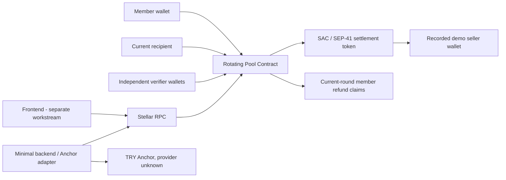

# Stellerpool Backend & Soroban Implementation Plan

Source of truth: `docs/plan.md` (sponsorless model, 19 Eylül 2026 revision). This implementation plan translates that product and economic model into phased contract/backend work. When older repository notes conflict with `docs/plan.md`, this plan follows `docs/plan.md`.

Current status: **Phase 13 is complete.** The contract (schema/API version 10) adds Draw-mode recipient selection and a 30-member ceiling on top of the sponsorless model, redeployed to Testnet and verified field-for-field against the frontend's already-written client (`frontend/src/services/pool.ts`, `frontend/src/types/pool.ts`). Phases 1-11 below describe the superseded sponsor-based generation (schema/API version 8) and are kept as historical record only.

## 1. Current Repository State

Implemented (Draw mode + 30 members, API v10, Phase 13):

- Protocol 28 Rust workspace with `soroban-sdk 28.0.0`; `rotating_pool` multi-pool contract crate.
- Typed pool/member/round models, storage keys, errors, events, persistent-storage TTL helpers, read API, SDK test snapshots, canonical WASM build.
- `OrderMode { Fixed, Draw }` on `Pool`/`create_pool`; `RoundPhase::AwaitingDraw`; `RoundState.recipient: Option<Address>`; permissionless `draw_recipient(pool_id, caller) -> Address` picking uniformly (via `env.prng()`) among members with `received == false`, emitting `RecipientDrawn`.
- `MAX_MEMBERS` raised 12 → 30; the `execute_round` per-member refund-liability reset loop and the `start_pool` per-member terms-approval storage loop are both removed (refund entitlement is derived from the current round's deposit flag at claim time; `start_pool` trusts `terms_approvals.len() == member_limit`).
- Terms proposal/approval (members only), verifier quorum, member-only-pays-own-contribution round funding, purchase proposal/approval, demo-seller payout, round advancement, Grace/abort, current-round-only refund, permissionless start/cancel/mark-overdue/execute/abort — unchanged from Phase 12.
- No sponsor, guarantee, advance, or top-up concept anywhere in the contract, storage, events, or errors.
- Redeployed to Testnet as a new contract instance; `scripts/deploy_testnet.sh` (unchanged, never called `create_pool`) and `scripts/demo_testnet.sh` (extended with a Draw-mode Pool C) both target it.

Not implemented yet:

- Backend and Anchor adapter beyond the SDF test anchor already wired into the frontend (blocked on a real provider/home domain for TRY, unchanged since Phase 0).

The frontend is maintained by a separate workstream and was not edited; Phase 13 achieved compatibility entirely from the contract side, verified against `frontend/src/services/pool.ts` and `frontend/src/types/pool.ts`.

## 2. Requirements Extracted From Documentation

The controlling requirements from `docs/plan.md` are:

- MVP is a closed, fixed-member group (2-12 members) with one equal contribution `C` per member per round, `N` rounds, and each member the recipient exactly once. Lottery and variable amounts are out of scope.
- Members do not lock entry collateral. There is **no sponsor, sponsor guarantee, sponsor advance, third-party top-up, or platform delivery guarantee**. A shortfall is never assumed to be covered by new users' contributions.
- The creator only proposes. Order, verifiers, amounts, durations, and the demo seller become valid only when **all members approve the same terms version**. The creator can neither change terms nor withdraw funds alone.
- Lifecycle is `Filling -> Active -> Completed | Aborted`. A round is `Collecting -> Grace -> AwaitingPurchase -> Settled`.
- A round proceeds to purchase only when **every member has paid their own contribution** in that round. There is no payment on behalf of another member.
- After the collect deadline, a fixed, non-extendable grace period starts; a missing member may cure once. If the round is still incomplete, anyone may end the pool.
- Refund scope is limited to the **current, unfinished round**: each member can reclaim only what they personally deposited into that round. Contributions of rounds already paid to a seller are never refundable by the contract.
- The round allocation goes to the pre-set demo seller, not to the recipient member. The recipient proposes seller, asset, amount, and document digest; independent verifiers approve; the threshold is `ceil(2/3 x verifier count)`.
- There is a separate purchase deadline. If the proposal or approvals do not arrive in time, the current round's contributions become refundable.
- `execute_round` is permissionless once all contributions are in, approvals reach the threshold, the purchase window is open, and the seller can receive the asset.
- Every balance and claim is scoped by `pool_id`; pools never cross-subsidize one another; the contract's total token balance is never a round's available amount.
- Amounts are integer token base units. TRY/fiat conversion remains in the Anchor layer.
- No yield, lending, staking, liquidity strategy, unilateral upgrade, or admin escape hatch.
- The open economic risk is documented and must stay visible: after an early recipient is paid out, that member's later non-payment cannot be recovered by the contract, and adding more members does not remove it.
- Testnet/demo claims must distinguish simulated purchase verification from real property or vehicle delivery.

## 3. Architecture

Contract:

- Owns authoritative pool configuration, membership, order, terms approvals, rounds, contributions, purchases, approvals, current-round refund liabilities, claims, and lifecycle.
- Transfers only the pool's configured token.
- Pays only the recorded demo seller for the current round.

Backend:

- Discovers and orchestrates Anchor flows. May cache RPC/Anchor status and provide diagnostics.
- Never decides financial state, approvals, payout amount, refund entitlement, or pool solvency.

Off-chain verifier/legal layer:

- Validates seller identity, documents, property/vehicle records, and legal security. Produces approvals for test data in the hackathon prototype.
- Recovery of a defaulting early recipient's remaining obligation is an off-chain/legal matter and is not guaranteed by the demo.

## 4. On-chain vs Off-chain Responsibilities

ON-CHAIN:

- Pool creation and immutable active configuration (including durations, setup deadline, demo seller).
- Membership, versioned terms proposal/approval, and fixed recipient order.
- Round deadlines, grace deadlines, purchase deadlines, and lifecycle transitions.
- Per-member per-round contribution records and per-pool assigned balance.
- Purchase proposal (seller, asset, amount, document digest), verifier approvals bound to a proposal version, and quorum.
- Exact seller payout, current-round refund entitlement, and claim replay protection.
- Typed events.

OFF-CHAIN:

- Anchor SEP-1/10/24/6/12/38 orchestration as supported by a real provider.
- KYC/AML, TRY payment rails, issuer risk, and exchange-rate disclosure.
- Seller, invoice/contract, title/deed/registration, mortgage/lien, and legal collection verification.
- Recovery of obligations of members who received an allocation and then stopped paying.
- Notifications, monitoring, indexing, metadata, and demo evidence.

The backend is never the financial source of truth.

## 5. Storage Design

Instance storage:

- `NextPoolId -> u64`

Persistent storage, always scoped by `pool_id`:

- `Pool(pool_id) -> Pool` (members, recipient order, verifiers, terms version/approvals, durations, deadlines, demo seller, status embedded)
- `Member(pool_id, member) -> MemberState` (`received`)
- `Round(pool_id, round) -> RoundState` (phase, deadlines, paid list, seller, document digest, purchase version, approvals embedded)
- `Deposit(pool_id, round, member) -> bool`
- `PoolAssignedBalance(pool_id) -> i128` (equals the sum of current-round deposits)
- `RefundLiability(pool_id, member) -> i128` (that member's deposit in the current unfinished round only)
- `RefundClaimed(pool_id, member) -> bool`

Removed with the sponsor model: `GuaranteeBalance`, `RoundTopUp`, `SponsorAdvance`, `SponsorRemainderClaimed`, and the cumulative `MemberContributionTotal` and `TotalRefundLiability` keys (refund entitlement no longer spans rounds).

TTL policy:

- Extend instance TTL on global reads/writes.
- Extend persistent TTL for every touched financial record.
- Ensure TTL horizons cover the full pool, grace, purchase, abort, and claim periods; keep explicit TTL tests.

## 6. Contract API

Target API (17 methods; names and arguments match `frontend/src/services/pool.ts` exactly):

- `create_pool(creator, token, contribution_amount, member_limit, round_duration, grace_duration, purchase_duration, setup_deadline, demo_seller) -> pool_id`
- `join_pool(pool_id, member)`; no entry collateral transfer.
- `propose_terms(pool_id, creator, recipient_order, verifiers) -> version`; a new proposal clears earlier approvals.
- `approve_terms(pool_id, approver, version)`; members only, valid for the current version only.
- `start_pool(pool_id)`; permissionless once membership is full and every member approved the current version.
- `cancel_unstarted_pool(pool_id)`; permissionless after `setup_deadline` while still `Filling`. Nothing is locked in `Filling`, so no transfer occurs.
- `deposit(pool_id, member)`; `cure_payment(pool_id, member)` during Grace. Only the member pays their own contribution, once per round.
- `propose_purchase(pool_id, member, seller, asset, amount, doc_hash) -> proposal_version`; current recipient only; seller must equal `demo_seller`.
- `approve_purchase(pool_id, round, verifier, proposal_version)`
- `execute_round(pool_id)`
- `mark_overdue(pool_id)`; permissionless after the collect deadline (moves the round to Grace).
- `abort_pool(pool_id)`; permissionless when Grace or the purchase window has expired without completion.
- `claim_refund(pool_id, member)`; pays only the member's own current-round deposit, once.
- Reads: `get_pool`, `get_round`, `get_member_status` (`{refundable, received}`), plus `version`, `next_pool_id`, `has_pool`, `get_refund_claim`.

Removed: `fund_guarantee`, `top_up`, `repay_advance`, `claim_sponsor_remainder`, `get_sponsor_advance`, `get_sponsor_remainder_claimed`, and the `sponsor` argument of `create_pool`.

Verifier policy: 2 to 10 addresses; approval threshold is computed as `ceil(2/3 x verifier count)`; creator, members, token contract, and pool contract cannot be verifiers.

Authorization:

- Creator: create and propose terms only.
- Member: join, approve terms, deposit/cure, propose a purchase for their own current allocation, and claim their refund.
- Verifier: approve a purchase once per proposal version.
- Permissionless: start (when approved), cancel unstarted, mark overdue, execute a ready round, and abort after expiry.

## 7. Events

Typed event set: `PoolCreated`, `MemberJoined`, `TermsProposed`, `TermsApproved`, `PoolStarted`, `PoolCancelled`, `ContributionDeposited`, `PaymentCured`, `RoundOverdue`, `PurchaseProposed`, `PurchaseApproved`, `RoundPaid`, `PoolAborted`, `RefundClaimed`, `PoolCompleted`.

Removed: `GuaranteeFunded`, `SponsorTopUp`, `SponsorRemainderClaimed`. Events support audit and indexing but do not replace contract storage as financial truth.

## 8. Invariants

- The pool cannot start until membership is full and every member approved the current terms version; the recipient order is a duplicate-free permutation of members.
- Joining does not transfer or reserve member funds.
- No function treats the contract's total token balance as one pool's available balance; every transfer is charged to one `pool_id` and one defined purpose.
- A member contributes at most once per round, only for themselves.
- A round becomes ready for purchase only when all `N` members are recorded as `paid` and the round pot equals `N x C`.
- `PoolAssignedBalance(pool_id)` equals the sum of `RefundLiability(pool_id, member)` at all times: the contract holds exactly the current unfinished round's deposits for that pool.
- Seller payout equals exactly one full round pot, goes only to the recorded demo seller, and atomically clears that round's liabilities and assigned balance.
- Approvals count only for the current `proposal_version` of the current round; a new proposal deletes stale approvals.
- Grace deadline is fixed as `collect deadline + grace duration`; delayed triggering cannot extend recovery time. Normal deposits close at the collect deadline; only cure payments are accepted during Grace.
- The purchase window starts once when all contributions are in; renewing a proposal does not reset it.
- After abort, `claim_refund` returns only the member's own current-round deposit and cannot be claimed twice. Rounds already settled to a seller carry no refund entitlement.
- Active financial configuration, order, token, amounts, durations, demo seller, and verifier policy are immutable.
- Failed checks or transfers leave all state and balances unchanged.

## 9. Security Risks

- Missing or incorrect `require_auth` on creator/member/verifier actions.
- Overflow in `N x C`.
- Cross-pool balance contamination when pools share one token contract; using total contract balance instead of per-pool assigned accounting.
- Paying an unapproved or substituted seller, or a seller that cannot receive the asset (trustline, freeze, clawback).
- Creator/verifier collusion, duplicate verifiers, or a weak approval threshold.
- Double deposit, approval, payout, or refund.
- A refund that reaches back into a settled round, or a payout that leaves the current round's refunds underfunded.
- Unsafe transitions among Collecting, Grace, AwaitingPurchase, Settled and pool Aborted/Completed.
- Unbounded member/verifier loops; TTL expiry for financial state or claims.
- Frozen/clawed-back SAC assets and issuer risk.
- **Accepted, documented economic risk:** an early recipient who stops paying cannot be recovered on-chain; later members' earlier contributions are not returned. This must stay visible in every demo and UI.
- Misrepresenting simulated Testnet verification as real property delivery.
- Upgrade/admin escape paths. Default remains no upgrade mechanism.

## 10. Anchor Integration Strategy

The provider remains unknown and must not be invented.

- SEP-1 discovers provider endpoints and capabilities; SEP-10 authenticates when required.
- SEP-24 is preferred for hosted deposit/withdraw UX; SEP-6 is the fallback for programmatic flows.
- SEP-12 and SEP-38 are used only when provider requirements/capabilities demand them.
- Anchor transaction state never marks a Soroban round contribution as paid; only the contract deposit call does.
- Asset issuer, redemption, freeze/clawback, fees, minimums, and TRY conversion risk must be disclosed.

## 11. Test Strategy

Contract unit tests:

- Authorization boundaries for creator, member, verifier, and permissionless callers.
- Join without collateral, duplicate join, capacity; terms proposal, version reset, approval only for the current version, start gating on full membership and all approvals.
- Cancel unstarted after the setup deadline (no transfer).
- Deposit once per round; cure only during Grace; no deposit after the collect deadline.
- Round readiness requires all members' own payments; no proxy payment path exists.
- Purchase proposal: recipient only, seller must be the demo seller, asset and amount must match, document digest non-zero; approvals bound to proposal version; duplicate approval rejected; threshold `ceil(2/3 x n)`.
- Exact seller payout; failed transfer rolls everything back; pool isolation for balances and claims.
- Abort eligibility (Grace expiry, purchase deadline expiry) and current-round-only refunds; double-refund rejection; no refund for a settled round.
- **Plan demo scenario:** first round fully paid and settled, second-round recipient of round 1 stops paying, Grace expires, abort, only round-2 deposits refunded, round-1 amounts unrecoverable.
- Cure path: the late member pays during Grace and the round proceeds.
- TTL and arithmetic boundaries; SDK differential snapshots for ledger/auth/event changes.

Integration/Testnet tests:

- Canonical optimized WASM build; SAC/test token setup.
- Four-member, contribution-10 happy path (first round pays the demo seller 40 units).
- Second-round default, Grace, abort, and current-round-only refunds.
- Cure path where the late member pays in Grace.
- Record contract/token IDs and transaction hashes.

## 12. Phase Plan

Phases 0-11 describe the **sponsor-based generation** and are kept as historical record. Phases 12 and 13 are complete.

### PHASE 12 - Sponsorless Realignment

Status: completed on 2026-09-19. Trigger: `docs/plan.md` revision of 19 Eylül 2026 removed the sponsor model; the frontend client already matched it.

Delivered: the contract was rewritten to exactly the section 6 API (21 exported functions: the 17 the frontend calls plus `version`/`next_pool_id`/`has_pool`/`get_refund_claim`), redeployed to Testnet as a new instance, and the plan's canonical demo scenario plus the cure-during-Grace path were both run live. See `docs/IMPLEMENTATION_LOG.md` for full evidence (contract ID, WASM hash, transaction hashes).

Scope:

- Remove `sponsor` from `Pool` and `create_pool`; delete `fund_guarantee`, `top_up`, `repay_advance`, `claim_sponsor_remainder`, `get_sponsor_advance`, `get_sponsor_remainder_claimed`, and their storage keys, events, errors, and types (`GuaranteeBalance`, `RoundTopUp`, `SponsorAdvance`, `SponsorRemainderClaimed`, guarantee/required-guarantee fields).
- `approve_terms` and `start_pool`: approvals come from members only; no guarantee gate.
- `cancel_unstarted_pool`: no sponsor refund; nothing is locked in `Filling`, so it only marks the pool cancelled.
- Round readiness: all `N` members must have `paid` themselves; delete the recipient-self-pay-plus-old-advance special case and every advance check in `execute_round`.
- Refund model: `RefundLiability` and `PoolAssignedBalance` cover the current unfinished round only; `execute_round` clears the round's liabilities and assigned balance atomically; drop cumulative contribution totals and cross-round solvency checks. `get_member_status.refundable` returns the caller's current-round deposit.
- Keep the 17-method API from section 6 and every field the frontend's `mapPool`/`mapRound`/`mapMember` reads (`frontend/src/services/pool.ts`, `frontend/src/types/pool.ts`), minus the removed sponsor fields.
- Rename and rewrite sponsor-based tests and snapshots; add the plan demo scenario from section 11.
- Update `scripts/demo_testnet.sh` (no guarantee, no sponsor identity, no remainder claim) and `scripts/README.md`; keep `scripts/deploy_testnet.sh` unchanged.
- Bump the API/schema version to 9; build the canonical WASM; redeploy to Testnet as a new instance (the v8 instance stays as a historical artifact); publish the new contract ID and `VITE_ROTATING_POOL_CONTRACT_ID`.

Definition of Done:

- `stellar contract info interface` on the built WASM lists exactly the section 6 methods (plus the four read helpers); no `sponsor`, `guarantee`, `advance`, or `top_up` symbol remains outside the historical docs.
- Parameter and field names match the frontend client, verified by reading `frontend/src/services/pool.ts` against the Rust signatures and by `stellar contract bindings typescript` output.
- The plan demo scenario passes as a unit test and runs live on Testnet: round 1 pays the demo seller, round 2 stops after a missing payment, only round-2 deposits are refunded.
- Cure path runs live: the late member pays in Grace and the round proceeds.
- `docs/IMPLEMENTATION_LOG.md` records the new contract ID, WASM hash, and key transaction hashes.
- Frontend untouched.

### PHASE 13 - Draw Mode and 30 Members

Status: completed on 2026-09-19. Trigger: product direction of 19 Eylül 2026 (evening) toward the Fuzul Ev/Oto model: a **draw** (kura) instead of a fixed order, and **larger groups**. The frontend was already built for it (`OrderMode`, `AwaitingDraw`, `draw_recipient`, `VITE_MAX_MEMBERS`) and detects support from the on-chain interface.

Full specification, acceptance criteria and test list: **`docs/CONTRACT_HANDOFF.md`**. Delivered exactly that scope:

- Added `OrderMode { Fixed, Draw }` to `Pool`/`create_pool` (new parameter right after `member_limit`, matching the frontend's expected position); added `RoundPhase::AwaitingDraw`; `RoundState.recipient` is now `Option<Address>`.
- New `draw_recipient(pool_id, caller) -> Address`: callable by anyone (`caller.require_auth()`, no membership/role gate) once every member has paid (`AwaitingDraw`); picks uniformly among members with `received == false` using `env.prng().gen_range` (single candidate is picked deterministically without drawing); emits `RecipientDrawn`; the phase moves to `AwaitingPurchase`. `NotDrawPool` rejects the call on a `Fixed`-order pool.
- `purchase_deadline` starts the moment a round enters `AwaitingDraw` (not only at `AwaitingPurchase`) and covers the whole draw+purchase window; `abort_pool` now also accepts `AwaitingDraw` (via the same `purchase_deadline`, reason `BlockedSettlement`), so an undrawn, fully-funded round can still be aborted and refunded like an unsettled purchase.
- Raised `MAX_MEMBERS` 12 → 30. Removed both O(member_limit) storage-read loops the handoff called out: `execute_round` no longer resets a per-member `RefundLiability` entry (that storage key was deleted entirely — refund entitlement is derived at `claim_refund`/`get_member_status` time from `has_deposit(pool, current_round, member) && !refund_claimed`, which is exactly equivalent since only the round active when a pool aborts is ever refundable); `start_pool` no longer re-reads a per-member terms-approval flag and instead trusts `pool.terms_approvals.len() == pool.member_limit` (sound because `approve_terms` only ever appends a member once, per version).
- Bumped `CONTRACT_VERSION` to 10, redeployed as a new Testnet instance (the v9 instance stays live as a historical artifact), published the new contract ID and `VITE_MAX_MEMBERS=30` into `.env`/`frontend/.env`.
- Extended `scripts/demo_testnet.sh` with a live Draw-mode Pool C (two rounds, both drawn on-chain) and `create_pool_with_mode`/`create_and_start_pool`'s new `order_mode` argument.

Definition of Done — all met:

- `cargo test -p rotating-pool`: 27/27 passing, including a 4-member and a 30-member Draw full-flow test (no repeat winners, full coverage, last round deterministic), Fixed-vs-Draw `propose_terms` validation, `AwaitingDraw` deadline/abort/refund, and the plan's canonical early-winner-defaults scenario for Draw mode.
- A dedicated 30-member resource test (`thirty_member_round_operations_stay_within_mainnet_resource_limits`) captures real `InvocationResources` for `deposit`, `draw_recipient`, and `execute_round` at `member_limit = 30`; soroban-sdk 28 also enforces `InvocationResourceLimits::mainnet()` on every invocation in `Env::default()` tests by default, so every 30-member test run is itself a passing resource check. Numbers recorded in `docs/IMPLEMENTATION_LOG.md`.
- `stellar contract info interface` on the built WASM matches `frontend/src/services/pool.ts` / `types/pool.ts` field-for-field (method names, `create_pool` parameter order including `order_mode`, `Pool.order_mode`, `RoundState.recipient: Option<Address>`, `RoundPhase::AwaitingDraw`, no `fund_guarantee`/`top_up`).

Risk that stays open by design: the early-recipient default. Draw and larger groups do not reduce it (`docs/plan.md` section 2).

> **Historical (sponsor-based generation).** Phases 0-11 below describe the contract that Phase 12 replaces. They are kept unchanged as record; do not treat their sponsor requirements as current.

### PHASE 0 - Discovery, Skills, Architecture Plan

Status: completed.

### PHASE 1 - Contract Workspace and Typed Skeleton

Status: completed.

Delivered Protocol 28 workspace, models, storage helpers, errors/events, read API, tests, snapshots, and WASM build.

### PHASE 2 - Sponsor Model Foundation and Filling Lifecycle

Status: completed and approved on 2026-09-19.

Scope:

- Remove Phase 1 member-collateral placeholders.
- Add sponsor, grace duration, and required-guarantee fields.
- Add checked guarantee formula.
- Implement `create_pool`, `fund_guarantee`, `join_pool`, `leave_pool`, and `start_pool`.
- Enforce auth, capacity, Filling-only mutations, guarantee minimum, and immutable recipient order.
- Add SAC-backed unit tests proving join takes no member funds.

Definition of Done:

- Four-member/contribution-10 pool requires guarantee 40.
- Sponsor funds guarantee into the contract under a separate per-pool key.
- Members can join/leave Filling pools without token movement.
- A full funded pool starts only with an exact member permutation.
- No frontend changes.

### PHASE 3 - Contribution and Liability Accounting

Status: completed and approved on 2026-09-19.

- Implement member `deposit` and one-payment-per-round enforcement.
- Add per-pool assigned balance, member contribution totals, round pot, and preliminary refund-liability ledger.
- Test multi-pool isolation and token balance invariants.

Definition of Done:

- Active members transfer exactly the configured contribution amount once per round.
- Round, member, refund-liability, and pool-assigned ledgers update atomically.
- Failed token transfers leave every accounting record unchanged.
- Pools sharing one token remain isolated by `pool_id`.
- No frontend changes.

### PHASE 4 - Purchase Proposal and Independent Approval

Status: completed and approved on 2026-09-19.

- Finalize immutable verifier set and quorum.
- Implement seller/document proposal by the current recipient.
- Implement verifier approvals and anti-replay checks.
- Test fake seller, unauthorized verifier, duplicate approval, and creator-only rejection.

Definition of Done:

- A pool cannot start without a valid independent verifier policy.
- Only the current recipient can record one seller and non-zero document digest after the round pot is ready.
- Participant, contract, token, and verifier addresses cannot be substituted as the seller.
- Only allowlisted authenticated verifiers approve, once each, and at least two approvals are required.
- Policy, purchase, and approvals remain scoped by `pool_id` and round.
- No frontend changes.

### PHASE 5 - Solvent Seller Payout and Round Transition

Status: completed and approved on 2026-09-19.

- Implement permissionless `execute_round`.
- Require full member contributions or explicitly recorded sponsor top-up.
- Enforce approved seller and post-payment refund solvency.
- Transfer exactly one round allocation to the seller and advance/finalize the pool.

Definition of Done:

- Anyone can execute a ready round without privileged authorization.
- Stored approval count, approval keys, quorum state, pot, and top-up records are revalidated before payout.
- Seller receives exactly `member_count * contribution_amount` from that pool's assigned balance.
- Completed-round liabilities are reclassified before a post-payment solvency check.
- Failed checks or token transfers leave the round, pool, allocations, and liabilities unchanged.
- Non-final execution creates the next fixed-order round; final execution marks the pool Completed.
- No frontend changes.

### PHASE 6 - Overdue, Grace, Cure, and Sponsor Top-Up

Status: completed on 2026-09-19; awaiting approval before Phase 7.

- Implement `mark_overdue`, `cure_payment`, `top_up`, Grace, and Paused transitions.
- Keep sponsor top-up separate from member payment/debt status.
- Test deadlines, repeated actions, and safe return to Active.

Definition of Done:

- Normal contribution deposits stop exactly at the round deadline.
- An underfunded round enters Grace with a deterministic, non-extendable deadline.
- Missing members can cure once during Grace using the normal contribution ledger.
- Sponsor can fund exactly the remaining shortfall without setting any member deposit/debt record.
- Fully funded recovery returns the pool to Active and supports approved seller execution.
- An underfunded pool becomes Paused permissionlessly when Grace expires.
- Failed cure/top-up transfers leave all state and accounting unchanged.
- No frontend changes.

### PHASE 7 - Abort, Member Refunds, and Sponsor Remainder

Status: completed on 2026-09-19; awaiting approval before Phase 8.

- Implement permissionless abort after recovery conditions expire.
- Freeze and persist refund entitlements.
- Implement delivered/not-delivered member refund rules and double-claim protection.
- Allow sponsor remainder only after member liabilities are protected.

Definition of Done:

- `abort_pool` is permissionless and succeeds only from `Paused`, the state that already encodes an expired grace period on an underfunded round.
- Abort transitions the pool to `Aborted`, which blocks every deposit/execute/cure/top-up/pause/second-abort mutation through existing status guards, so entitlements need no separate freeze step.
- `claim_refund` pays each member's own `RefundLiability`, which already equals the correct delivered/not-delivered entitlement because `execute_round` only ever zeroes a member's liability when that member's own round settles.
- Double refund claims are rejected via a persistent per-member claimed flag.
- `claim_sponsor_remainder` pays `PoolAssignedBalance - TotalRefundLiability`, so the sponsor need not wait for every member to individually claim; the computation is order-independent with member claims and only pays out funds not reserved for an outstanding member liability.
- Double sponsor-remainder claims and a zero/negative remainder are rejected.
- Failed refund/remainder token transfers leave claimed flags and ledgers unchanged.
- No frontend changes.

### PHASE 8 - Full Security and Invariant Suite

Status: skipped by explicit user decision on 2026-09-19 to prioritize Testnet deployment and demo evidence ahead of the Rise In x Stellar Pro Hackathon 2026 submission deadline (19-20 Eylül). Not a technical judgment that the contract needs no further review; the existing 29-test suite from Phases 1-7 and the Soroban Common Mistakes checklist applied inline during every phase remain the only security coverage. Revisit before any non-hackathon/production use.

- Complete authorization, arithmetic, TTL, cross-pool, malicious seller/verifier, and race-condition tests.
- Review against Soroban Common Mistakes and optionally run available audit tooling.

### PHASE 9 - Testnet Assets, Deployment Scripts, and Minimal Backend

Status: deployment-scripts scope completed on 2026-09-19 and deployed live to Testnet; backend/Anchor adapter remains out of scope until a real provider/home domain is known.

- Add SAC/token and contract deployment/invocation scripts.
- Build provider-independent Anchor adapter and diagnostics only after a real home domain is supplied.
- Keep backend non-authoritative.

Delivered:

- `scripts/deploy_testnet.sh`: builds the canonical WASM, generates/funds a Testnet deployer identity, deploys the contract, resolves (or deploys) the settlement-asset SAC wrapper, runs a read-only smoke test, and writes the resulting IDs into `.env`/`frontend/.env`. Idempotent — safe to re-run.
- `scripts/README.md`: prerequisites and usage.
- A live Testnet deployment produced with this exact workflow (contract ID, WASM hash, token ID, transaction hashes) is recorded in `docs/IMPLEMENTATION_LOG.md`.

Not delivered (deferred, matches the plan's own gating):

- Anchor adapter and SEP diagnostics: `ANCHOR_HOME_DOMAIN` is still unset; building this against an unknown/invented provider was explicitly ruled out from Phase 0 onward.
- A funded multi-member end-to-end demo (join, deposit, propose/approve, execute, and an abort/refund run): that is Phase 10.
- `backend/` remains an empty scaffold; nothing here required backend logic since the deploy script talks to Testnet directly via the Stellar CLI.

### PHASE 10 - End-to-End Demo and Submission Evidence

Status: completed on 2026-09-19 with real Testnet runs of both scenarios.

- Run normal and default/abort Testnet scenarios.
- Record IDs, hashes, commands, demo limitations, and real-versus-simulated boundaries.
- Prepare final README and hackathon evidence without editing frontend in this workstream.

Delivered:

- `scripts/demo_testnet.sh`: a reusable, self-contained script (issues its own demo asset, so no external faucet dependency) that runs the full happy-path lifecycle (join, fund guarantee, start, two fully-funded/approved/executed rounds, `Completed`) as Pool A, and the full default/abort/refund lifecycle (one missing member, overdue, grace expiry, pause, abort, member refund claim, sponsor remainder claim) as Pool B.
- Both scenarios were actually run against Stellar Testnet on the contract deployed in Phase 9; every pool ID, contract ID, token ID, and key transaction hash is recorded in `docs/IMPLEMENTATION_LOG.md`.
- Final on-chain state was read back and confirmed: Pool A `status: Completed`; Pool B `status: Aborted` with member1's refund and the sponsor's remainder both paid and the never-depositing member's entitlement confirmed at `0`.

Explicitly out of scope / simulated:

- The demo's settlement asset, seller, and "purchase document digest" are test fixtures. No real property/vehicle, licensed seller, or legal document verification is implied.
- No TRY/fiat anchor flow was exercised; `ANCHOR_HOME_DOMAIN` remains unset per Phase 9.

### PHASE 11 - Realign Contract to the Revised docs/plan.md and the Frontend's Client

Status: completed on 2026-09-19.

Between Phase 10 and this phase, `docs/plan.md` was substantially revised by a teammate (commit `aa0bc42`) and the frontend's contract client (`frontend/src/services/pool.ts`, `frontend/src/types/pool.ts`, commit `5060119`) was written against that revised plan's *assumed* function/field names (the frontend's own comments say so explicitly — no contract existed yet for that plan version when it was written). This phase rewrote the contract from scratch to match both exactly, field for field, so the already-written frontend client can call it without any changes on either side.

Scope:

- New pool lifecycle: `PoolStatus` is `Filling -> Active -> Completed | Aborted` (no pool-level `Grace`/`Paused` any more). Deadline handling moves to a round-level `RoundPhase`: `Collecting -> AwaitingPurchase -> Settled`, or `Collecting -> Grace -> AwaitingPurchase` when a round is late.
- `create_pool` gains `purchase_duration`, `setup_deadline`, and a `demo_seller` fixed at creation (previously the seller was freely chosen per round by the recipient).
- New `propose_terms`/`approve_terms`: the creator proposes the recipient order and verifier set; every member and the sponsor must each approve that exact version before `start_pool` (now permissionless, callable by anyone) will succeed. Changing the order or verifiers bumps the version and clears every prior approval.
- New `cancel_unstarted_pool`: permissionless once `setup_deadline` passes while still `Filling`; immediately refunds the sponsor's full guarantee.
- `top_up` is now scoped to one specific member's one missing contribution (no `amount` argument; always exactly `contribution_amount`), is rejected outright for the current round's recipient, and records a per-member, per-pool `SponsorAdvance` debt instead of contributing to that member's own refund liability. New `repay_advance` lets a member pay that debt back to the sponsor directly and clears it.
- A round only becomes `AwaitingPurchase` (and starts its own `purchase_duration` countdown) once its pot is fully funded **and** the recipient has personally paid their own contribution **and** the recipient owes no outstanding sponsor advance. `execute_round` re-checks both recipient conditions defensively before paying the seller.
- `propose_purchase` now also carries `asset` (must equal the pool's token) and `amount` (must equal the round's fixed payout) alongside the seller (must equal `demo_seller`) and document digest; `approve_purchase` binds each approval to a `proposal_version` so a changed proposal cannot be settled by stale approvals.
- `abort_pool` is permissionless from either round phase once its deadline passes: `Grace` past its deadline emits `AbortReason::SafetyRecovery`; `AwaitingPurchase` past its `purchase_deadline` emits `AbortReason::BlockedSettlement` (this reason, defined but unused since Phase 1, now has a real trigger).
- `leave_pool` and `configure_verifiers` are removed; neither exists in the revised plan or the frontend client. Verifier approval quorum is no longer creator-chosen — it is computed automatically as the ceiling of 2/3 of the verifier count, per `docs/plan.md`'s "demo için en az 2/3 eşik kullanılır."
- `MAX_MEMBERS` lowered from 20 to 12, per `docs/plan.md`'s explicit demo cap.
- `get_pool` and `get_round` now return one denormalized struct each (members/recipient order/verifiers/terms approvals embedded directly on `Pool`; paid/sponsor-advanced/approvals embedded directly on `RoundState`) instead of requiring separate calls, matching the frontend's single-read expectation. New `get_member_status` (`{refundable, received}`) and `get_sponsor_advance` read APIs match the frontend's `MemberStatus`/advance queries exactly.
- Contract API/schema version bumped from 7 to 8.

Definition of Done:

- Every one of the 22 contract methods the frontend's `EXPECTED_METHODS` list calls exists with matching parameter names; verified both by reading `frontend/src/services/pool.ts` line by line against the Rust signatures and by inspecting `stellar contract info interface` on the built WASM.
- Every field the frontend's `mapPool`/`mapRound`/`mapMember` functions read (`r.<field>`) exists with that exact name on the corresponding contract type; verified the same way.
- `PoolStatus` and `RoundPhase` enum variants match the frontend's `POOL_STATUSES`/`ROUND_PHASES` arrays exactly.
- New unit tests cover: terms propose/approve/version-reset, permissionless full-approval-gated start, setup-deadline cancellation with a full sponsor refund, the recipient-cannot-be-topped-up rule, sponsor-advance creation/repayment and its effect on round readiness, the fixed demo-seller/asset/amount purchase validation, proposal-version-bound approvals, both abort reasons (grace expiry and purchase-deadline expiry), and the existing delivered/not-delivered refund and sponsor-remainder invariants re-verified under the new state machine.
- Canonical WASM built and **redeployed** to Testnet as a new contract instance (the API is a breaking change from the Phase 9/10 instance, which is left untouched as a historical artifact).
- The full new lifecycle (join, propose/approve terms, fund guarantee, permissionless start, two funded/proposed/approved/executed rounds paying the fixed demo seller, `Completed`) was run live on Testnet against the new instance, exactly mirroring the calls the frontend would make, with every field of the resulting `get_pool`/`get_round` reads inspected and matching what the frontend expects. See `docs/IMPLEMENTATION_LOG.md` for the transaction hashes.
- Frontend untouched (compatibility was achieved entirely from the contract side, since the frontend was the fixed target).

## Documentation Conflicts / Open Questions

- **2026-09-19, sponsorless decision:** `docs/plan.md` removed the sponsor model (no sponsor, guarantee, advance, or remainder; refunds limited to the current unfinished round). The v8 contract and Phases 1-11 reflect the earlier sponsor-based plan. Phase 12 resolves this.
- Earlier requirements used one-contribution member collateral; `docs/plan.md` rejects it. Earlier payout design paid the recipient member directly; `docs/plan.md` requires an approved demo seller and off-chain document verification.
- The real Anchor provider, settlement asset, and TRY support remain unknown.
- One-contract-versus-per-pool deployment stays open. The MVP continues with one bounded multi-pool contract; all accounting must remain strictly isolated by `pool_id`.
- Who recovers a defaulting early recipient's remaining obligation, and under which contract, is a legal/product question outside the contract (`docs/plan.md` section 8).
- Historical: the earlier post-Phase 10 divergence between the contract and a revised `docs/plan.md` was resolved by Phase 11; the new divergence is resolved by Phase 12.

## Frontend Team Action Required

- Display member contributions, the current round's refund entitlement, seller, verifier status, and pool-assigned balance as separate values. Do not show any sponsor or guarantee value.
- Never present a member join as locking collateral, and never present the demo as guaranteeing delivery or recovery of earlier rounds.
- Keep the open economic risk visible (early recipient default, earlier-round contributions not refundable).
- Never label a Testnet seller/document approval as real title, deed, registration, mortgage, or lien verification.
- Use contract/RPC state as financial truth and Anchor/backend status only for fiat-flow status.
- Done (19 Eylül 2026 evening): `VITE_ROTATING_POOL_CONTRACT_ID` was set to the Phase 12 instance and the read path (`getPool`/`getRound`/`getMemberStatus`) was verified against live Testnet data; this exposed that the SDK wraps `Result` returns in `Ok { value }`, now unwrapped in `services/pool.ts`.
- After Phase 13 publishes the new contract ID, set `VITE_ROTATING_POOL_CONTRACT_ID` and `VITE_MAX_MEMBERS=30`, and re-verify parameter names against the generated bindings.
