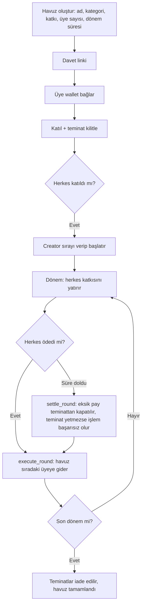

# EvAraç Tasarruf Havuzu — Plan

Türkiye'de yaygın olan katılım / birikim gruplarının (ev, araç gibi hedefler için) güvenli, şeffaf sürümü.
Para bir şirketin hesabında değil, Soroban kontratında durur. Kurallar kodda yazılıdır, kimse değiştiremez.

**Slogan:** Birlikte biriktir. Her şeyi doğrula. (*Save together. Verify everything.*)
**Track:** Genesis. **Deadline:** 20 Eylül 2026, 12:00.

## 1. Alınan kararlar

| Konu | Karar | Neden |
|---|---|---|
| Track | Genesis | Sıfırdan yeni ürün, Scale davetli |
| Kontrat sayısı | Tek `rotating_pool` kontratı, `pool_id` ile çok havuz | Factory riskli ve gereksiz; tek contract ID belgelemesi kolay |
| Sıra | Creator, `start_pool` sırasında verir, sonra kilitlenir | Başlamadan para hareket etmez, güvenli |
| Teminat | Katılırken 1 katkı kadar kilitlenir, havuz parasından **ayrı muhasebe edilir**, sonda `claim_collateral` ile iade edilir | Erken alanın ödemeyi bırakma riskini kısmen kapatır; havuz ve teminat karışırsa yanlış payout riski doğar |
| Son ödeme zamanı | Her turun `round_started_at` ve `round_deadline` değerleri kontratta tutulur; demoda süre 3 dakika | Zaman olmadan "ödemedi" durumu tanımlanamaz. 3 dakika **son ödeme süresidir**, bekleme süresi değil: herkes erken öderse `execute_round` hemen çalışır |
| Yönetici yetkisi | Creator para çekemez, upgrade fonksiyonu yok | Ana güven vaadi |
| Tetikleme | `execute_round` ve `settle_round` herkes çağırabilir | Kimseye bağımlı değil |
| Anchor | Workshop'un TRY anchor'ı; SEP-24 tercih edilir (anchor destekliyorsa), yoksa SEP-6. Gerçek sağlayıcı ve SEP workshop sonrası kilitlenir | Handbook: "a user should be able to put real Turkish lira in and get a usable balance out, or the reverse". Belirli bir SEP zorunlu kılınmıyor. Sandbox/test akışının şartı karşılayıp karşılamadığı belgede açık değil, organizatöre sorulacak |
| Wallet | Stellar Wallets Kit | Dökümandaki uygun partner |
| Frontend | Vue 3 + TypeScript | Ekibin seçimi, framework zorunluluğu yok |
| Backend | Yok, sadece anchor için gerekirse ince bir proxy | 24 saatte gereksiz yük |
| Kategoriler | Ev / Araç / Eğitim / Diğer, sadece etiket | Kullanıcı tanıdık modeli görsün; kontratta fark yok |
| Kura | Yok, sıra sabit | Rastgelelik MVP dışı |

## 2. İki tarafı nasıl koruyoruz

**Ödeyip sırasını bekleyen üye**
- Para kontratta, yönetici çekemez.
- Sırası başladıktan sonra değiştirilemez.
- Sıra ona gelince herkes ödemişse havuzun tamamı otomatik gönderilir.

**Diğer üyeler / grup**
- Herkes teminat kilitler. Biri ödemezse eksik parça teminatından kapatılır.
- Kim ödedi, kim ödemedi, zincirde herkese açık.

**Dürüst sınır:** Teminat 1 katkı kadar. Erken alan kişi bundan fazlasını alıp bırakırsa grup zarar görebilir. Aynı üye ikinci kez ödemezse teminat yetmez, `settle_round` başarısız olur ve havuz bloke olabilir (bkz. bölüm 4). Tam çözüm (sıraya göre artan teminat, itibar, rezerv, iptal/iade) roadmap'te.

## 3. Kullanıcı akışı

Yatırma: yerel para → anchor → Stellar asset → kullanıcı wallet'ı → `deposit`.
Çekme: hak sahibi Stellar asset'i anchor ile yerel paraya çevirip bankasına çeker.
Handbook gerçek TL girişi veya çıkışı istiyor. Kontrat para biriminden bağımsız kalır (sadece bir Stellar asset görür), TL sadece anchor katmanında. Demoda en az bir yönü (giriş veya çıkış) gerçek olmalı.

**Tutar:** Demo tutarı seçilen anchor'ın desteklediği en küçük TL tutarıdır (destekliyorsa 1 TL, değilse anchor'ın minimumu). Bu değer kontrata sabitlenmez. Kontrat TL'yi görmez, anchor sonucunda ortaya çıkan Stellar asset miktarıyla çalışır. Anchor TL-cinsinden bir Stellar asset verirse 1 TL = 1 token olur; USDC verirse miktar değişkendir, bu yüzden arayüz kullanıcıya katkıdan biraz fazla yatırmasını önerir (tampon). Anchor belli olunca kesinleştirilecek.

## 4. Kontrat (`contracts/rotating_pool`)

**Fonksiyonlar**
- `create_pool` — havuzu oluşturur, `pool_id` döner
- `join_pool` — katılır, teminatı kilitler, trustline'ı kontrol eder
- `start_pool` — creator sırayı verir, dönem 1 başlar
- `deposit` — üye o dönemin katkısını yatırır
- `execute_round` — **herkes ödediyse** (süre beklemeden) o turun havuzunu sıradaki üyeye gönderir
- `settle_round` — **`now >= round_deadline`** ise eksik katkıyı ilgili üyenin teminatından kapatır, sonra havuzu gönderir. Teminat yetmiyorsa **işlem başarısız olur**
- `claim_collateral` — havuz `Completed` olunca üye kalan teminatını geri alır (**P0**)
- `get_pool`, `get_round`, `get_member_status` — okuma
- `abort_pool` — (P1, öneri) bloke olmuş havuzda süre + bekleme sonrası herkes çağırabilir, o turun katkıları ve kalan teminatlar iade edilir

**Durumlar:** `Filling → Active → Completed`. "Round hazır" durumu saklanmaz, deposit sayısından türetilir.

**Saklama:** Havuz ayarı bir anahtarda. Teminat, deposit ve tur havuzu **ayrı anahtarlarda** tutulur, `extend_ttl` çağrılır:
- `Collateral(pool_id, üye) → miktar`
- `Deposit(pool_id, round, üye) → bool`
- `RoundPot(pool_id, round) → miktar`
- Tur zamanları: `round_started_at`, `round_deadline`

**Yetki:** `deposit`, `join_pool`, `start_pool` için `require_auth`. Creator'ın para hareketi yetkisi yok.

**Kurallar:**
- **Değişmezlik:** `start_pool` sonrası üye, sıra ve katkı tutarı değişmez.
- **Muhasebe (kritik güvenlik kuralı):** `execute_round` ve `settle_round` **kontratın toplam bakiyesini değil**, yalnızca `katkı × üye sayısı` kadar tur havuzunu gönderir. Teminatlar kontratta kalır. Örnek: 4 üye, 10 USDC katkı, 10 USDC teminat → kontrat 80 USDC tutar, Alice'e 40 USDC gider, 40 USDC teminat olarak kalır.
- **Tur zamanlaması:** Tur 1, `start_pool` anında başlar. Tur N+1, `execute_round(N)` veya `settle_round(N)` çalıştığı anda başlar ve `duration` kadar süre verir.
- **Teminat kullanımı:** Süre dolduğunda eksik üyenin katkısı onun teminatından tur havuzuna aktarılır, üye teminatı azalır.
- **İkinci default:** Kalan teminat eksik katkıyı karşılamıyorsa `settle_round` **başarısız olur**. Eksik havuz alıcıya gönderilmez, çünkü birikim planının ekonomik kuralı bozulur. Sonuç: her üye için en fazla bir kaçırılmış katkı emilir, sonrası havuzu bloke edebilir. Bu sınır README'de açıkça yazılır.
- **Olaylar:** `CollateralConsumed { pool_id, round, member, amount }` ve `MemberDefaulted { pool_id, round, member }` yayınlanır.
- **Değişmez test:** kontrat bakiyesi = tüm kalan teminatlar + henüz dağıtılmamış turun katkıları. Muhasebe hatası bu testle yakalanır.

## 5. Demo ve Definition of Done

Demo: 4 üye (Alice, Bob, Charlie, David), örnek olarak 10 USDC katkı ve 10 USDC teminat (tutarlar yapılandırılabilir), son ödeme süresi demoda 3 dakika. Sıra: Alice, Bob, Charlie, David.

**Tur 1 — mutlu yol:** dört üye öder, `execute_round` süre beklemeden çalışır, 40 USDC Alice'e gider, Stellar.Expert'te görünür.
**Tur 2 — default koruması:** Charlie ödemez, süre dolar, `settle_round` Charlie'nin 10 USDC teminatından eksik payı kapatır, 40 USDC Bob'a gider. Charlie'nin kalan teminatı 0 olarak gösterilir.

1. Alice havuzu oluşturur, diğerleri katılıp teminat yatırır.
2. Alice sırayı verip başlatır.
3. Bir üye katkısını **anchor üzerinden gerçek TL ile** yatırır (TL → Stellar asset → `deposit`).
4. 4 üye ödeyince `execute_round`: 40 USDC Alice'e gider, Stellar.Expert'te görünür.
5. Round 2'de Charlie ödemez, süre dolar, `settle_round` teminatından kapatır, Bob'a ödeme gider. Arayüz "Katkı yapılmadı ⚠, 10 USDC teminattan karşılandı" gösterir.
5b. Havuz tamamlanınca üyeler `claim_collateral` ile kalan teminatlarını geri alır.
6. (İsteğe bağlı, giriş çalışıyorsa) Bir hak sahibi payout'ı anchor ile TL'ye çevirip çeker. Handbook giriş **veya** çıkıştan birini yeterli sayıyor.

Bu çalışmadan sonra başka özelliğe geçilmez.

## 6. Önceliklendirme

**P0 Kontrat:** `create_pool`, `join_pool`, `start_pool`, `deposit`, `execute_round`, `settle_round`, `claim_collateral`, `get_pool`, `get_round`, `get_member_status`. Teminat, deposit ve tur havuzu ayrı muhasebe.
**P0 Blockchain:** kontrat testleri (değişmez test dahil), Testnet deploy, asset entegrasyonu, wallet
**P0 Anchor:** organizatörün kabul ettiği gerçek local payment akışı (handbook'ta zorunlu, Ecosystem Fit'in en ağırlıklı parçası)
**P0 Demo:** Vue dashboard, Tur 1 başarı, Tur 2 teminat ile default koruması
**P1:** `abort_pool`, UX cilası, 4–10 gerçek kullanıcı testi ve geri bildirim, README'de kurulum/test/değerlendirme talimatları, kullanılan Stellar Skills'e referans, SCF/InstaAwards sonraki adımı, sunum
**P2:** backend metadata/davet, Blend/DeFindex ile getiri, sıraya göre artan teminat

## 7. Ekip görevi (4 kişi)

| Rol | İş |
|---|---|
| Kontrat | Rust/Soroban, testler, Testnet deploy, contract ID |
| Frontend | Vue, wallet bağlama, havuz sayfası, katkı ödeme, geçmiş |
| Entegrasyon | Anchor entegrasyonu (SEP-24 tercih, anchor destekliyorsa), trustline, USDC faucet, yatır/çek akışı |
| Ürün/Sunum | README, Mermaid diyagram, kullanıcı testi, Stellar şablonuyla sunum, demo |

## 8. Jüri eşlemesi

1. **Fikir/Etki:** Merkezi katılım gruplarında paranın kaybolması ve güvensizlik problemi, hedef kitle Türkiye'deki birikim grupları
2. **Teknik:** Testnet'te uçtan uca akış, Soroban auth/storage, teminat mantığı, Mermaid diyagram
3. **Ecosystem Fit:** Soroban = tasarruf/tahsisat motoru, anchor = gerçek local payment (en yüksek ağırlık), Wallets Kit = kullanıcı yetkilendirme ve wallet UX. Yalnızca "Wallets Kit kullandık" argümanına yaslanılmaz. Kullanılan Stellar skills belgelenir
4. **UX:** "Bu ay ödemen: ₺X [Öde]", kontrat çağrısı görünmez, kripto bilmeyen kullanıcıya uygun
5. **Traction:** 4–10 kullanıcı, havuz/katkı/round sayıları
6. **Doküman:** README, contract ID'ler, kurulum, demo, resmi şablonla sunum, SCF/InstAwards hazırlığı

## 9. Sınırlar (README'ye yazılacak)
- Teminat 1 katkı kadar. MVP, her üye için en fazla bir kaçırılmış katkıyı emer; sonraki default'lar havuzu bloke edebilir (`abort_pool` P1). Tam temerrüt koruması yok.
- Kura yok, sıra sabit.
- Non-custodial olan havuz mantığı. USDC ihraççısı ve anchor merkezi taraflardır.
- Kontrat upgrade edilemez.
- Testnet MVP'dir. Gerçek parayla kullanmadan önce hukuki danışmanlık gerekir; ürün kredi veya finansman sağlamaz.

## 10. Roadmap
Sıraya göre artan teminat → itibar skoru → temerrüt rezervi → sigorta → doğrulanabilir rastgele kura → diğer ülkelerin yerel para birimi anchor'ları.
**Sonraki adım (handbook istiyor):** SCF / InstaAwards başvurusu.

## 11. Açık noktalar (kontrol edilecek)
- **Anchor'ın adı:** Döküman "using an anchor or another anchor from the list" diyor ve workshop'ta "how anchor works as a TRY anchor" geçiyor. Anchor'ın adı export'ta düşmüş görünüyor. Organizatörlerden veya 11:00 workshop'undan öğrenilecek.
- **Testnet'te gerçek TL nasıl?** Anchor'ın testnet mi mainnet mi sunduğu ve gerçek TL'nin nasıl kullanılacağı workshop'ta sorulacak.
- **Wallets Kit tek başına yeterli mi?** Dökümanda cevap yok, Integration şartını kesin karşıladığı varsayılmaz. Anchor'ı çekirdek entegrasyon sayıyoruz, Wallets Kit destek.
- Teminatın USDC mi olacağı ve trustline gereksinimi.
- Anchor'ın minimum TL tutarı ve hangi Stellar asset'i verdiği (TL-cinsinden token mı, USDC mi).

**Organizatöre / mentora sorulacaklar:**
1. "Does the provided TRY Anchor sandbox/test flow satisfy the Anchor / Local Payments judging requirement, or must actual fiat move through production banking rails?"
2. "Does the selected Anchor count toward both the Integration requirement and the Anchor / Local Payments requirement, or should we demonstrate a separate eligible ecosystem integration?"
