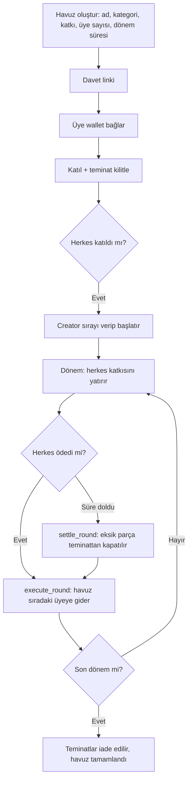

# EvAraç Tasarruf Havuzu — Plan

Türkiye'de yaygın olan katılım / birikim gruplarının (ev, araç gibi hedefler için) güvenli, şeffaf sürümü.
Para bir şirketin hesabında değil, Soroban kontratında durur. Kurallar kodda yazılıdır, kimse değiştiremez.

**Slogan:** Birlikte biriktir. Her şeyi doğrula. (*Save together. Verify everything.*)
**Track:** Genesis. **Deadline:** 20 Eylül 2026, 12:00.

## 1. Alınan kararlar

| Konu | Karar | Neden |
|---|---|---|
| Track | Genesis | Sıfırdan yeni ürün, Scale davetli |
| Kontrat sayısı | Tek `rotating_pool` kontratı, `pool_id` ile çok havuz | Factory riskli ve gereksiz; tek contract ID belgelemesi kolay |
| Sıra | Creator, `start_pool` sırasında verir, sonra kilitlenir | Başlamadan para hareket etmez, güvenli |
| Teminat | Katılırken 1 katkı kadar kilitlenir, sonda iade | Erken alanın ödemeyi bırakma riskini kısmen kapatır |
| Son ödeme tarihi | Her dönemin süresi kontratta tutulur | Tarih olmadan "ödemedi" durumu tanımlanamaz |
| Yönetici yetkisi | Creator para çekemez, upgrade fonksiyonu yok | Ana güven vaadi |
| Tetikleme | `execute_round` ve `settle_round` herkes çağırabilir | Kimseye bağımlı değil |
| Anchor | Workshop'un TRY anchor'ı (SEP akışı), gerçek TL giriş veya çıkış | Handbook: "a user should be able to put real Turkish lira in and get a usable balance out, or the reverse". "Not mocked or hardcoded" şartı var, mock anchor kabul edilmez |
| Wallet | Stellar Wallets Kit | Dökümandaki uygun partner |
| Frontend | Vue 3 + TypeScript | Ekibin seçimi, framework zorunluluğu yok |
| Backend | Yok, sadece anchor için gerekirse ince bir proxy | 24 saatte gereksiz yük |
| Kategoriler | Ev / Araç / Eğitim / Diğer, sadece etiket | Kullanıcı tanıdık modeli görsün; kontratta fark yok |
| Kura | Yok, sıra sabit | Rastgelelik MVP dışı |

## 2. İki tarafı nasıl koruyoruz

**Ödeyip sırasını bekleyen üye**
- Para kontratta, yönetici çekemez.
- Sırası başladıktan sonra değiştirilemez.
- Sıra ona gelince herkes ödemişse havuzun tamamı otomatik gönderilir.

**Diğer üyeler / grup**
- Herkes teminat kilitler. Biri ödemezse eksik parça teminatından kapatılır.
- Kim ödedi, kim ödemedi, zincirde herkese açık.

**Dürüst sınır:** Teminat 1 katkı kadar. Erken alan kişi bundan fazlasını alıp bırakırsa grup zarar görebilir. Tam çözüm (sıraya göre artan teminat, itibar, rezerv) roadmap'te.

## 3. Kullanıcı akışı

Yatırma: yerel para → anchor → Stellar asset → kullanıcı wallet'ı → `deposit`.
Çekme: hak sahibi Stellar asset'i anchor ile yerel paraya çevirip bankasına çeker.
Handbook gerçek TL girişi veya çıkışı istiyor. Kontrat para biriminden bağımsız kalır (sadece bir Stellar asset görür), TL sadece anchor katmanında. Demoda en az bir yönü (giriş veya çıkış) gerçek olmalı.

## 4. Kontrat (`contracts/rotating_pool`)

**Fonksiyonlar**
- `create_pool` — havuzu oluşturur, `pool_id` döner
- `join_pool` — katılır, teminatı kilitler, trustline'ı kontrol eder
- `start_pool` — creator sırayı verir, dönem 1 başlar
- `deposit` — üye o dönemin katkısını yatırır
- `execute_round` — herkes ödediyse havuzu sıradaki üyeye gönderir
- `settle_round` — süre dolmuşsa eksik katkıyı teminattan kapatır ve devam eder
- `claim_collateral` — havuz bitince kalan teminatı iade eder
- `get_pool`, `get_round`, `get_member_status` — okuma

**Durumlar:** `Filling → Active → Completed`. "Round hazır" durumu saklanmaz, deposit sayısından türetilir.

**Saklama:** Havuz ayarı bir anahtarda, her deposit ayrı anahtarda (`Deposit(pool_id, round, üye)`), `extend_ttl` çağrılır.

**Yetki:** `deposit`, `join_pool`, `start_pool` için `require_auth`. Creator'ın para hareketi yetkisi yok.

**Kurallar:** Havuz başladıktan sonra üye, sıra ve katkı tutarı değişmez. Bir üye ikinci kez ödemezse teminat kalmadığı için o dönem eksik ödenir ve olay zincire yazılır (limit olarak belgelenir).

## 5. Demo ve Definition of Done

Demo: 4 üye (Alice, Bob, Charlie, David), 10 USDC katkı, 10 USDC teminat, dönem süresi demoda 3 dakika. Sıra: Alice, Bob, Charlie, David.

1. Alice havuzu oluşturur, diğerleri katılıp teminat yatırır.
2. Alice sırayı verip başlatır.
3. Bir üye katkısını **anchor üzerinden gerçek TL ile** yatırır (TL → Stellar asset → `deposit`).
4. 4 üye ödeyince `execute_round`: 40 USDC Alice'e gider, Stellar.Expert'te görünür.
5. Round 2'de Charlie ödemez, süre dolar, `settle_round` teminatından kapatır, Bob'a ödeme gider.
6. (İsteğe bağlı, giriş çalışıyorsa) Bir hak sahibi payout'ı anchor ile TL'ye çevirip çeker. Handbook giriş **veya** çıkıştan birini yeterli sayıyor.

Bu çalışmadan sonra başka özelliğe geçilmez.

## 6. Önceliklendirme

**P0:** kontrat (`create/join/start/deposit/execute_round`), Testnet deploy, Vue dashboard
**P0:** teminat + son ödeme tarihi + `settle_round`
**P0:** anchor akışı (handbook'ta zorunlu, Ecosystem Fit'in en ağırlıklı parçası)
**P1:** teminat iadesi (`claim_collateral`), UX cilası, 4–10 gerçek kullanıcı testi ve geri bildirim
**P1:** README'de kurulum, test ve değerlendirme talimatları, kullanılan Stellar Skills'e referans, SCF/InstaAwards sonraki adımı
**P2:** backend metadata/davet, Blend/DeFindex ile getiri, sıraya göre teminat

## 7. Ekip görevi (4 kişi)

| Rol | İş |
|---|---|
| Kontrat | Rust/Soroban, testler, Testnet deploy, contract ID |
| Frontend | Vue, wallet bağlama, havuz sayfası, katkı ödeme, geçmiş |
| Entegrasyon | Anchor (SEP-24), trustline, USDC faucet, yatır/çek akışı |
| Ürün/Sunum | README, Mermaid diyagram, kullanıcı testi, Stellar şablonuyla sunum, demo |

## 8. Jüri eşlemesi

1. **Fikir/Etki:** Merkezi katılım gruplarında paranın kaybolması ve güvensizlik problemi, hedef kitle Türkiye'deki birikim grupları
2. **Teknik:** Testnet'te uçtan uca akış, Soroban auth/storage, teminat mantığı, Mermaid diyagram
3. **Ecosystem Fit:** Stellar + Soroban + Wallets Kit + anchor (en yüksek ağırlık), kullanılan Stellar skills'in belgelenmesi
4. **UX:** "Bu ay ödemen: ₺X [Öde]", kontrat çağrısı görünmez, kripto bilmeyen kullanıcıya uygun
5. **Traction:** 4–10 kullanıcı, havuz/katkı/round sayıları
6. **Doküman:** README, contract ID'ler, kurulum, demo, resmi şablonla sunum, SCF/InstAwards hazırlığı

## 9. Sınırlar (README'ye yazılacak)
- Teminat 1 katkı kadar; tam temerrüt koruması yok.
- Kura yok, sıra sabit.
- Non-custodial olan havuz mantığı. USDC ihraççısı ve anchor merkezi taraflardır.
- Kontrat upgrade edilemez.
- Testnet MVP'dir. Gerçek parayla kullanmadan önce hukuki danışmanlık gerekir; ürün kredi veya finansman sağlamaz.

## 10. Roadmap
Sıraya göre artan teminat → itibar skoru → temerrüt rezervi → sigorta → doğrulanabilir rastgele kura → diğer ülkelerin yerel para birimi anchor'ları.
**Sonraki adım (handbook istiyor):** SCF / InstaAwards başvurusu.

## 11. Açık noktalar (kontrol edilecek)
- **Anchor'ın adı:** Döküman "using an anchor or another anchor from the list" diyor ve workshop'ta "how anchor works as a TRY anchor" geçiyor. Anchor'ın adı export'ta düşmüş görünüyor. Organizatörlerden veya 11:00 workshop'undan öğrenilecek.
- **Testnet'te gerçek TL nasıl?** Anchor'ın testnet mi mainnet mi sunduğu ve gerçek TL'nin nasıl kullanılacağı workshop'ta sorulacak.
- **Wallets Kit tek başına yeterli mi?** Dökümanda cevap yok. Anchor'ı çekirdek entegrasyon sayıyoruz, Wallets Kit destek.
- Teminatın USDC mi olacağı ve trustline gereksinimi.
- Teminatın USDC mi olacağı ve trustline gereksinimi.
